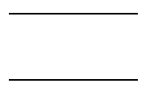

# DM-CSS The Fast Compact CSS Toolkit for Designers
<!-- TOC -->

- [Introduction](#introduction)
  - [Benefits](#benefits)
  - [Basic usage](#basic-usage)
- [Setup](#setup)
  - [Install as NPM module](#install-as-npm-module)
  - [Use the CDN](#use-the-cdn)
- [CSS Borders](#css-borders)
  - [Border values](#border-values)
  - [Removing Borders](#removing-borders)
  - [Border top](#border-top)
  - [Border bottom](#border-bottom)
  - [Border left](#border-left)
  - [Border right](#border-right)
  - [Border left-right sides](#border-left-right-sides)
  - [Border top-bottom sides](#border-top-bottom-sides)
  - [Border circle radius](#border-circle-radius)
  - [Border Pill styles](#border-pill-styles)
- [Border corner radius](#border-corner-radius)
  - [Border line style](#border-line-style)
- [Position](#position)
  - [Z-Index](#z-index)
- [Size](#size)
- [Spacing](#spacing)
- [Font](#font)
- [Text](#text)
- [Utility](#utility)
- [Display](#display)
- [Flexbox](#flexbox)
- [Grid](#grid)

<!-- /TOC -->
## Introduction

Powerful CSS styling made simple, fast and fun!

DM-CSS is a Style-Notation CSS layout and design Toolkit.

It brings consistency to your Web page coding and allows you to quickly add CSS styles that are easy to read.

### Benefits

Some of the features of DM-CSS Toolkit you will enjoy right away.

- Small size
- Fast loading
- Robust and compact Style-Notation.
- Consistent, easy to use and learn.
- Designed for Designer, yet developer friendly!
- No side effect, works like your own custom CSS styles.

### Basic usage

DM-CSS Style-Notation are added to the "**class**" attribute of the HTML Tag.

For example if you want to center text and capitalize it, the Style-Notation would look like the following.

```html
<div class="ttc tt-upcase b1 dash w20">centered text</div>
```


The Style-Notation read from left to right above adds the following CSS styles.

1. Text transform center.
1. Text transform uppercase.
1. Draw a border 1px wide.
1. Set border line style to dashed (default is solid).
1. Set div element to take up 20% of the available width.

As you can see DM-CSS Style-Notation are powerful and can be combined together to increase productivity.

## Setup

There are two ways to install DM-CSS Toolkit as a dependency in your project.

1. Install as a NPM module.
1. Use the CDN.

### Install as NPM module

From your project root, type:

```sh
npm install --save dm-css
```

### Use the CDN

To use a CDN, add the following **\<link\>** Tag to your **index.html** file.

```html
<link href="https://unpkg.com/dm-css@0.0.4/css/dm.min.css" rel="stylesheet">
```

**Note**: It is advisable not to use the CDN in production if you require 100% availability.

Early rough draft.

DM-CSS Introduce class notation for applying CSS styling.

## CSS Borders

The default border style is solid. The notation provides the flexibility to add and remove borders.

An element can be given borders on

1. All sides
1. No sides
1. One side (top, bottom, left ,right)
1. Two sides (top-bottom or left-right)

### Border values

The value for the border denote the thickness of the border line. The supported values range from 0 to 4.

A value of '0' (zero) indicates no border.

For borders on all sides use notation, "**b[1-4]**".


```html
<div class="b1"> ... </div>
<div class="b2"> ... </div>
<div class="b3"> ... </div>
<div class="b4"> ... </div>
```

|Notation|Side|
|-|-|
|b|Border all sides|
|bt|Border top|
|bb|Border bottom|
|bl|Border left|
|br|Border right|
|bx|Border left and right|
|by|Border top and bottom|

### Removing Borders

You may want to remove borders. To do this use a value of "0" (zero) with one of the notations listed above.

```html
<div class="b0"> ... </div>
<div class="bt0"> ... </div>
<div class="bb0"> ... </div>
<div class="bl0"> ... </div>
<div class="br0"> ... </div>
<div class="by0"> ... </div>
<div class="bx0"> ... </div>
```

You can also use a combination to remove only one side like this:


```html
<div class="b3 br0"> ... </div>
```

### Border top

```html
<div class="bt0"> ... </div>
<div class="bt1"> ... </div>
<div class="bt2"> ... </div>
<div class="bt3"> ... </div>
<div class="bt4"> ... </div>
```

### Border bottom

```html
<div class="bb0"> ... </div>
<div class="bb1"> ... </div>
<div class="bb2"> ... </div>
<div class="bb3"> ... </div>
<div class="bb4"> ... </div>
```

### Border left

```html
<div class="bl0"> ... </div>
<div class="bl1"> ... </div>
<div class="bl2"> ... </div>
<div class="bl3"> ... </div>
<div class="bl4"> ... </div>
```

### Border right

```html
<div class="br0"> ... </div>
<div class="br1"> ... </div>
<div class="br2"> ... </div>
<div class="br3"> ... </div>
<div class="br4"> ... </div>
```

### Border left-right sides


```html
<div class="bx0"> ... </div>
<div class="bx1"> ... </div>
<div class="bx2"> ... </div>
<div class="bx3"> ... </div>
<div class="bx4"> ... </div>
```

### Border top-bottom sides



```html
<div class="by0"> ... </div>
<div class="by1"> ... </div>
<div class="by2"> ... </div>
<div class="by3"> ... </div>
<div class="by4"> ... </div>
```

### Border circle radius

To draw a circular border, use notation "**circle**". The element must have its CSS height and width property set.

Do not forget to include the border notation, "**b**", as it governs the border property on an element, whereas "**circle**" sets the border radius value.

The "**circle**" notation set the circle radius to 50%.

Below are three boxes with the dimensions of: 80x40, 80x80, 40x80


```html
<div class="box1 b circle"></div>
<div class="box2 b circle"></div>
<div class="box3 b circle"></div>
```

```css
.box {
  width: 80px;
  height: 80px;
}
```

### Border Pill styles

There are four pill styles for curved borders.


```html
<div class="b pill1"></div>
<div class="b pill2"></div>
<div class="b pill3"></div>
<div class="b pill4"></div>
```

## Border corner radius

You may specify border corner radius, the values range from 1 to 7. These radius size follow a Golden ratio.

A radius value of "0" (zero) will reset border to have square corners.

```html
<div class="b radius0"></div>
<div class="b radius1"></div>
<div class="b radius2"></div>
<div class="b radius3"></div>
<div class="b radius4"></div>
<div class="b radius5"></div>
<div class="b radius6"></div>
<div class="b radius7"></div>
```

You can also set the border values for each corner using one of the following notations.

|Notation|Radius side|
|-|-|
|tl-radius|Top left|
|tr-radius|Top right|
|bl-radius|Bottom left|
|br-radius|Bottom right|

|Notation|Radius sides|
|-|-|
|t-radius|Top face|
|b-radius|Bottom face|
|l-radius|Left face|
|r-radius|Right face|

### Border line style

You can change the border line style from solid to dashed.

```html
<div class="b dash"></div>
<div class="b t-dash"></div>
<div class="b b-dash"></div>
<div class="b l-dash"></div>
<div class="b r-dash"></div>
<div class="b x-dash"></div>
<div class="b y-dash"></div>
```

## Position

|Notation|Position|CSS property|
|-|-|
|pos-t|Top|top: 0|
|pos-b|Bottom|bottom: 0|
|pos-l|Left|left: 0|
|pos-r|Right|right: 0|

### Z-Index

The default z-index has a value of 1.

- z[1-4]

- relative
- absolute
- fixed

## Size

Fixed width

- w[0-100]
- h[0-100]

- w-min
- w-max

- h-min
- h-max

## Spacing

- pt0

- p[1-7]

- pt
- pb
- pl
- pr
- py
- px
- py-auto
- px-auto

- m0
- m1[1-7]
- mt
- mb
- ml
- mr
- my
- mx
- my-auto
- mx-auto

## Font

- fh[1-7]
- fh-[1-7]

|Notation|Font style|
|-|-|
|fsn|Font style none, reset all styles|
|fsb|Bold|
|fsi|Italic|
|fsu|Underline|
|fss|Strike-through|
|fsw|Wavy underline|

Font weight

- fw[100-900]

## Text

Text transform

|Notation|Notation|Text transform|
|ttl|tt-left|Left align|
|ttc|tt-center|Center text|
|ttr|tt-right|Right align|
|ttj|tt-justify|Justify text|

- tt-caps
- tt-upcase
- tt-lowcase
- tt-none

- tt-overflow-y
- tt-overflow-n

## Utility

- visible
- invisible
- center-x
- center-y
- center

## Display

- show
- hide
- d-none
- d-inline
- d-inline-block
- d-block
- d-table
- d-table-cell
- d-flex
- d-inline-flex
- d-grid
- d-inline-grid

## Flexbox

## Grid
