# Power Packed CSS Styling for Everyone!


[](https://greenkeeper.io/)


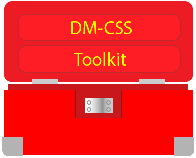

<!-- TOC -->

- [Introduction](#introduction)
- [CSS Resets](#css-resets)
  - [Box models](#box-models)
  - [Benefits](#benefits)
  - [Basic usage](#basic-usage)
- [Setup](#setup)
  - [Starter HTML file](#starter-html-file)
  - [Install as NPM module](#install-as-npm-module)
  - [Use the CDN](#use-the-cdn)
- [CSS Borders](#css-borders)
  - [Border values](#border-values)
  - [Border Style-Notation](#border-style-notation)
  - [Border top](#border-top)
  - [Border bottom](#border-bottom)
  - [Border left](#border-left)
  - [Border right](#border-right)
  - [Border left-right sides](#border-left-right-sides)
  - [Border top-bottom sides](#border-top-bottom-sides)
  - [Removing Borders](#removing-borders)
- [Border radius](#border-radius)
  - [Corner radius](#corner-radius)
  - [Equal radius corners](#equal-radius-corners)
  - [Corner radius](#corner-radius-1)
  - [Face radius](#face-radius)
  - [Border line style](#border-line-style)
  - [Circle radius](#circle-radius)
  - [Pill styles borders](#pill-styles-borders)
- [Position](#position)
  - [Z-Index](#z-index)
- [Size](#size)
- [Spacing](#spacing)
  - [Padding](#padding)
  - [Padding top](#padding-top)
  - [Padding bottom](#padding-bottom)
  - [Padding left](#padding-left)
  - [Padding right](#padding-right)
  - [Padding Y](#padding-y)
  - [Padding X](#padding-x)
  - [Margins](#margins)
- [Font](#font)
  - [Height scaling up](#height-scaling-up)
  - [Height scaling down](#height-scaling-down)
  - [Font styles](#font-styles)
  - [Font weight](#font-weight)
- [Text](#text)
  - [Text justification](#text-justification)
  - [Text vertical alignmen](#text-vertical-alignmen)
  - [Text transformation styles](#text-transformation-styles)
  - [Text wrapping](#text-wrapping)
  - [Text overflow](#text-overflow)
- [Utility](#utility)
  - [Visibility](#visibility)
  - [Centering](#centering)
- [Display](#display)
- [Lists](#lists)
  - [Bullet styles](#bullet-styles)
  - [Bullet placement](#bullet-placement)
- [List orientation](#list-orientation)
  - [List style reset](#list-style-reset)
- [Floats](#floats)
  - [Clearfix](#clearfix)
- [Lists](#lists-1)
- [Flexbox](#flexbox)
  - [Direction](#direction)
  - [Wrap mode](#wrap-mode)
  - [Justify main axis](#justify-main-axis)
  - [Justify cross axis](#justify-cross-axis)
  - [Vertical align content](#vertical-align-content)
  - [Item vertical align](#item-vertical-align)
  - [Ordering](#ordering)
  - [Growing](#growing)
  - [Shrinking](#shrinking)
- [Grid](#grid)
- [Responsive Design](#responsive-design)

<!-- /TOC -->
## Introduction

Powerful CSS styling made simple, fast and fun!

DM-CSS is a Style-Notation CSS layout and design Toolkit.

It brings consistency to your HTML/JSX coding and allows you to quickly add CSS styles that are easy to read.

Works with Angular, React and Vue.js.

## CSS Resets

DM-CSS resets CSS style setting using "normalize.css" a well accepted cross-browser library. The top padding and margin values are set to "0" (zero), to make calculation straight forward.

The global box model is changed to use "**border-box**". This makes it easy for layout calculation and does not allow margin and padding values to grow outside the element box size.

The Root font family is set to "Roboto" with a height of 16px. This is the base (root) value other values are calculated off. This is done by using the "**rem**" CSS unit.

### Box models

DM-CSS default to using the "**border-box**" box model. You can however change this.

The long-form and short-form Style-Notation for selecting the box model.

```html
<div class="contentbox"> ... </div>
<div class="borderbox"> ... </div>

<div class="cbox"> ... </div>
<div class="bbox"> ... </div>
```

### Benefits

Some of the features of DM-CSS Toolkit you will enjoy right away.

- Small size (~72KB).
- Fast loading.
- Robust and compact Style-Notation.
- Consistent, easy to use and learn.
- Designed for Designer, yet developer friendly!
- No side effects, works like your own custom CSS styles.

### Basic usage

DM-CSS Style-Notation are added to the "**class**" attribute of the HTML Tag.

For example, if you want to center text and capitalize it, add a dashed border and give is a width of 20%, the Style-Notation would look like the following.


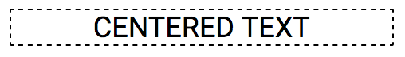

```html
<div class="ttc tt-upcase b1 dash w20">centered text</div>
```

The Style-Notation read from left to right adds the following CSS styles.

1. Center text.
1. Text transform uppercase.
1. Draw a border 1px wide.
1. Set border line style to dashed (default is solid).
1. Set "**\<div\>**" element to take up 20% of the available width.

As you can see the Style-Notation are powerful and can be combined together to increase productivity.

## Setup

In your root HTML file, it is a good idea to add the following responsive viewport meta tag.

```html
<meta name="viewport" content="width=device-width, initial-scale=1, shrink-to-fit=no">
```

DM-CSS requires HTML5 doctype.

```html
<!doctype html>
<html lang="en">
  ...
</html>
```

### Starter HTML file

You can use the following HTML file to start off with.

```html
<!doctype html>
<html lang="en">
  <head>
    <title>Hello, world!</title>
    <!-- Required meta tags -->
    <meta charset="utf-8">
    <meta name="viewport" content="width=device-width, initial-scale=1, shrink-to-fit=no">

    <!-- DM-CSS Toolkit -->
    <link href="https://cdn.jsdelivr.net/npm/dm-css@0.0.10/css/dm.min.css" rel="stylesheet">
  </head>
  <body>
    <h1>Hello, Inter-Web!</h1>
  </body>
</html>
```

There are two ways to install DM-CSS Toolkit as a dependency in your project.

1. Install as a NPM module.
1. Use the CDN.

### Install as NPM module

From your Node.js based project root, type:

```sh
npm install --save dm-css
```

### Use the CDN

To use the CDN, add the following **\<link\>** Tag to your **index.html** file, and enter the version of your choice.

```html
<link href="https://cdn.jsdelivr.net/npm/dm-css@<version>/css/dm.min.css" rel="stylesheet">
```

Example usage for DM-CSS NPM version 0.0.10.

```html
<link href="https://cdn.jsdelivr.net/npm/dm-css@0.0.10/css/dm.min.css" rel="stylesheet">
```

## CSS Borders

The border Style-Notation provides the flexibility to add and remove borders.

- The default border line style is solid.

An element can be given borders on:

- All sides
- No sides
- One side (top, bottom, left ,right)
- Two sides (top-bottom or left-right)

### Border values

The postfix value for a border denotes the thickness of the border line.

The supported values range is from 0 to 4.

A value of "0" (zero) indicates no border. You would use this to remove borders from a element that may already have borders.

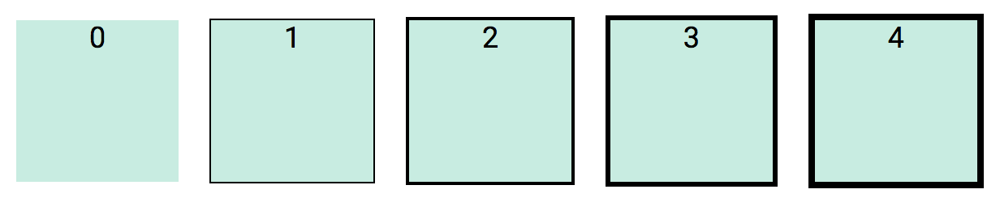

```html
<div class="b0"> ... </div>
<div class="b1"> ... </div>
<div class="b2"> ... </div>
<div class="b3"> ... </div>
<div class="b4"> ... </div>
```

### Border Style-Notation

Border thinkness value ranger from 0 to 4.

|Notation|Side|
|-|-|
|b|Border all sides|
|bt|Border top|
|bb|Border bottom|
|bl|Border left|
|br|Border right|
|bx|Border left and right|
|by|Border top and bottom|

### Border top

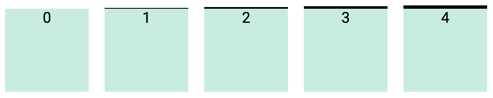

```html
<div class="bt0"> ... </div>
<div class="bt1"> ... </div>
<div class="bt2"> ... </div>
<div class="bt3"> ... </div>
<div class="bt4"> ... </div>
```

### Border bottom

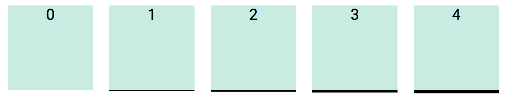

```html
<div class="bb0"> ... </div>
<div class="bb1"> ... </div>
<div class="bb2"> ... </div>
<div class="bb3"> ... </div>
<div class="bb4"> ... </div>
```

### Border left

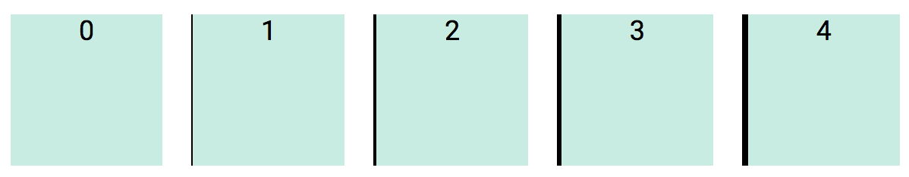

```html
<div class="bl0"> ... </div>
<div class="bl1"> ... </div>
<div class="bl2"> ... </div>
<div class="bl3"> ... </div>
<div class="bl4"> ... </div>
```

### Border right

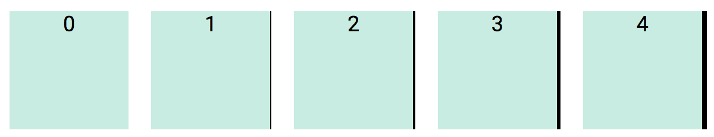

```html
<div class="br0"> ... </div>
<div class="br1"> ... </div>
<div class="br2"> ... </div>
<div class="br3"> ... </div>
<div class="br4"> ... </div>
```

### Border left-right sides

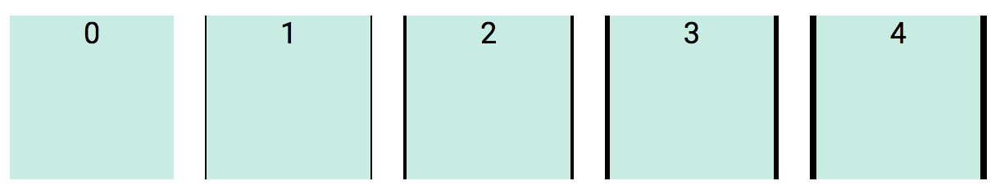

```html
<div class="bx0"> ... </div>
<div class="bx1"> ... </div>
<div class="bx2"> ... </div>
<div class="bx3"> ... </div>
<div class="bx4"> ... </div>
```

### Border top-bottom sides

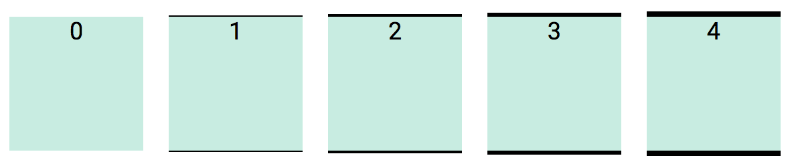

```html
<div class="by0"> ... </div>
<div class="by1"> ... </div>
<div class="by2"> ... </div>
<div class="by3"> ... </div>
<div class="by4"> ... </div>
```

### Removing Borders

There may be times you want to remove borders.

To do this, use a value of "0" (zero) with one of border Style-Notation.

```html
<div class="b0 "> ... </div>
<div class="bt0"> ... </div>
<div class="bb0"> ... </div>
<div class="bl0"> ... </div>
<div class="br0"> ... </div>
<div class="by0"> ... </div>
<div class="bx0"> ... </div>
```

You can use a combination of styles to remove only one side of the border.

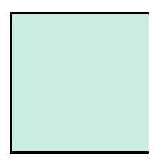

```html
<div class="b2 br0"> ... </div>
```

## Border radius

Border corners can be given a radius to round out the corners.

The border radius values range from 0 to 7. This scale follows the Golden Ratio.

A radius value of "0" (zero) will reset "round" borders to have square corners.

### Corner radius

When using borders, you may specify a radius value for each corner, shown later.

### Equal radius corners

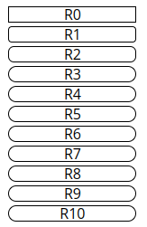

```html
<div class="b1 radius0"> ... </div>
<div class="b1 radius1"> ... </div>
<div class="b1 radius2"> ... </div>
<div class="b1 radius3"> ... </div>
<div class="b1 radius4"> ... </div>
<div class="b1 radius5"> ... </div>
<div class="b1 radius6"> ... </div>
<div class="b1 radius7"> ... </div>
```

Since the radius use a Golden Ratio, corner radius will look different for different dimensions as shown below.

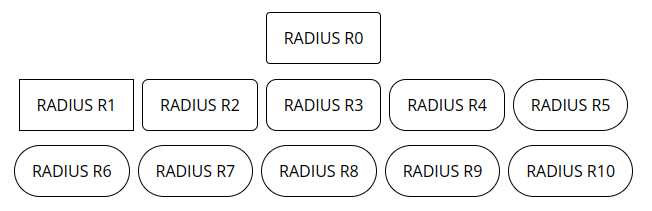

### Corner radius

You can set the individual border value for each corner using one of the following Style-Notation.

|Notation|Radius corner|
|-|-|
|tl-radius|Top left|
|tr-radius|Top right|
|bl-radius|Bottom left|
|br-radius|Bottom right|

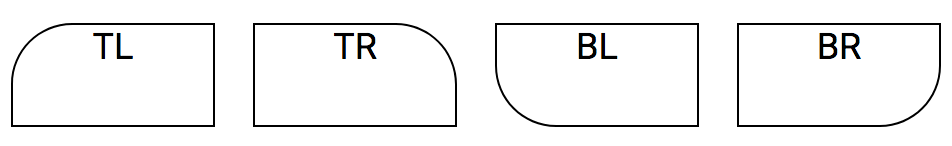

```html
<div class="b1 tl-radius0">TL</div>
<div class="b1 tr-radius1">TR</div>
<div class="b1 bl-radius2">BL</div>
<div class="b1 br-radius3">BR</div>
```

### Face radius

The face radius covers a side of the box to have round corners.

|Notation|Radius sides|
|-|-|
|t-radius|Top face|
|b-radius|Bottom face|
|l-radius|Left face|
|r-radius|Right face|

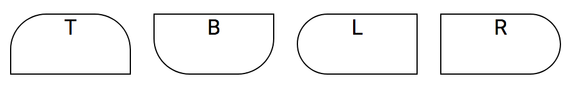

```html
<div class="b1 t-radius5">T</div>
<div class="b1 b-radius5">B</div>
<div class="b1 l-radius5">L</div>
<div class="b1 r-radius5">R</div>
```

### Border line style

You can change the border line style from solid to dashed.

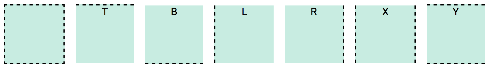

**Border dash**

```html
<div class="b2 dash"> ... </div>
<div class="b2 dasht"> ... </div>
<div class="b2 dashb"> ... </div>
<div class="b2 dashl"> ... </div>
<div class="b2 dashr"> ... </div>
<div class="b2 dashx"> ... </div>
<div class="b2 dashy"> ... </div>
```

**Border dot**

```html
<div class="b2 dot"> ... </div>
<div class="b2 dott"> ... </div>
<div class="b2 dotb"> ... </div>
<div class="b2 dotl"> ... </div>
<div class="b2 dotr"> ... </div>
<div class="b2 dotx"> ... </div>
<div class="b2 doty"> ... </div>
```

### Circle radius

To draw a circular border, use Style-Notation "**circle**".

You must include the border notation, "**b**", as it governs the border property on an element, whereas "**circle**" sets the border radius value.

- The "**circle**" notation uses a radius of 50%.

Below are three boxes with dimensions of: 80x40, 80x80, 40x80.

```css
.box1 { width: 80px; height: 40px; }
.box2 { width: 80px; height: 80px; }
.box2 { width: 40px; height: 80px; }
```

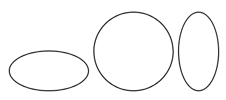

```html
<div class="box1 b1 circle"> ... </div>
<div class="box2 b1 circle"> ... </div>
<div class="box3 b1 circle"> ... </div>
```

### Pill styles borders

There are four pill styles for curved borders.

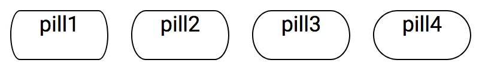

```html
<div class="b1 pill1"> ... </div>
<div class="b1 pill2"> ... </div>
<div class="b1 pill3"> ... </div>
<div class="b1 pill4"> ... </div>
```

## Position

An element static position property can be changed.

```html
<span class="relative"> ... </span>
<span class="absolute"> ... </span>
<span class="fixed"> ... </span>
<span class="static"> ... </span>
```

|Notation|Position|CSS property|
|-|-|-|
|pos-t|Top|top: 0|
|pos-b|Bottom|bottom: 0|
|pos-l|Left|left: 0|
|pos-r|Right|right: 0|

```html
<span class="pos-t"> ... </span>
<span class="pos-b"> ... </span>
<span class="pos-l"> ... </span>
<span class="pos-r"> ... </span>
```

### Z-Index

The default z-index has a value of 1.

```html
<span class="z1"> ... </span>
<span class="z2"> ... </span>
<span class="z3"> ... </span>
<span class="z4"> ... </span>
```

## Size

Scale value for width and height range from 10% to 100% and incremented by 10.

|Notation|Description|
|-|-|
|w|Set width|
|h|Set height|
|w-min| Set minimum width|
|w-max| Set maximum width|
|h-min| Set minimum height|
|h-max| Set maximum height|

Basic usage:

```html
<div class="w10"> ... </div>
<div class="w20"> ... </div>
<div class="w30"> ... </div>
<div class="w40"> ... </div>
<div class="w50"> ... </div>
<div class="w60"> ... </div>
<div class="w70"> ... </div>
<div class="w80"> ... </div>
<div class="w90"> ... </div>
<div class="w100"> ... </div>
```

## Spacing

The box model that DM-CSS uses is the "**border-box**". For more info see [MDN box-sizing](https://developer.mozilla.org/en-US/docs/Web/CSS/box-sizing).


The Style-Notation for spacing allows setting the margin and padding used by an element.

- Padding and margin scale values range from 0 to 7.
- Scale value follow the Golden Ratio.

**Pro Tip**:
In CSS, inline elements like "**\<p\>**" or "**\<span\>**" inherit their height values for margin and padding from surrounding text. You cannot change the height value for margin or padding for an inline element. If you want to be able to change these properties, you must change their display property from "**inline**" to "**inline-block**".

```html
<p class="d-inline-block"> ... </p>
<span class="d-inline-block"> ... </span>
```

Make sure you have a good understanding of CSS display types. How block and inline elements get rendered and ultimitaely how this will affect setting their width and height.

### Padding

|Notation|Padding|
|-|-|
|p|Pad all sides|
|pt|Pad top|
|pb|Pad bottom|
|pl|Pad left|
|pr|Pad right|
|py|Pad top and bottom|
|px|Pad left and right|

```html
<div class="p0">0</div>
<div class="p1">1</div>
<div class="p2">2</div>
<div class="p3">3</div>
<div class="p4">4</div>
<div class="p5">5</div>
<div class="p6">6</div>
<div class="p7">7</div>
```

### Padding top


```html
<div class="pt0">0</div>
<div class="pt1">1</div>
<div class="pt2">2</div>
<div class="pt3">3</div>
<div class="pt4">4</div>
<div class="pt5">5</div>
<div class="pt6">6</div>
<div class="pt7">7</div>
```

### Padding bottom


```html
<div class="pb0">0</div>
<div class="pb1">1</div>
<div class="pb2">2</div>
<div class="pb3">3</div>
<div class="pb4">4</div>
<div class="pb5">5</div>
<div class="pb6">6</div>
<div class="pb7">7</div>
```

### Padding left


```html
<div class="pl0">0</div>
<div class="pl1">1</div>
<div class="pl2">2</div>
<div class="pl3">3</div>
<div class="pl4">4</div>
<div class="pl5">5</div>
<div class="pl6">6</div>
<div class="pl7">7</div>
```

### Padding right


```html
<div class="pr0">0</div>
<div class="pr1">1</div>
<div class="pr2">2</div>
<div class="pr3">3</div>
<div class="pr4">4</div>
<div class="pr5">5</div>
<div class="pr6">6</div>
<div class="pr7">7</div>
```

### Padding Y


```html
<span class="py0">0</span>|<br/>
<span class="py1">1</span>|<br/>
<span class="py2">2</span>|<br/>
<span class="py3">3</span>|<br/>
<span class="py4">4</span>|<br/>
<span class="py5">5</span>|<br/>
<span class="py6">6</span>|<br/>
<span class="py7">7</span>|<br/>
```

### Padding X


```html
<span class="px0">0</span>|<br/>
<span class="px1">1</span>|<br/>
<span class="px2">2</span>|<br/>
<span class="px3">3</span>|<br/>
<span class="px4">4</span>|<br/>
<span class="px5">5</span>|<br/>
<span class="px6">6</span>|<br/>
<span class="px7">7</span>|<br/>
```

### Margins

|Notation|Margin|
|-|-|
|m|Margin all sides|
|mt|Margin top|
|mb|Margin bottom|
|ml|Margin left|
|mr|Margin right|
|mx|Margins left and right|
|my|Margins top and bottom|
|my-auto|Auto margins left and right|
|mx-auto|Auto margins top and bottom|
|ml-auto|Auto margins left |
|mr-auto|Auto margins right|

```html
<div class="m0">0</div>
<div class="m1">1</div>
<div class="m2">2</div>
<div class="m3">3</div>
<div class="m4">4</div>
<div class="m5">5</div>
<div class="m6">6</div>
<div class="m7">7</div>
```

## Font

Font heights follow a Golden Ratio scale from 1 to 7.

A font scale of 1 has a font height equal to the root element.

### Height scaling up

Higher scale values result progressively larger fonts, this is reverse of HTML heading values.

<small>(*) The image below is not to scale due to how markup works, it is used for illustration.</small>

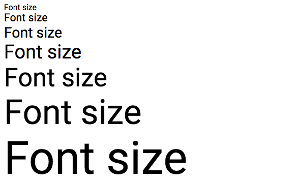

```html
<div class="fh1">Font height 1</div>
<div class="fh2">Font height 2</div>
<div class="fh3">Font height 3</div>
<div class="fh4">Font height 4</div>
<div class="fh5">Font height 5</div>
<div class="fh6">Font height 6</div>
<div class="fh7">Font height 7</div>
```

There are also 7 Headings, which as like the regular HTML heading tags.

```html
<div class="h1">Font height 1</div>
<div class="h2">Font height 2</div>
<div class="h3">Font height 3</div>
<div class="h4">Font height 4</div>
<div class="h5">Font height 5</div>
<div class="h6">Font height 6</div>
<div class="h7">Font height 7</div>
```

### Height scaling down

When font height is scaled down, the values become a fraction of the root font height.

The scale reduces font height successively by a factor of **10%**.

You will notice in the Style-Notation, scaled down fonts have a leading "-" dash before the value, this can be consider negative scaled values.

<small>(*) The image below is not to scale due to have markup works, it is used for illustration.</small>

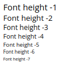

```html
<div class="fh-1">Font height 1</div>
<div class="fh-2">Font height 2</div>
<div class="fh-3">Font height 3</div>
<div class="fh-4">Font height 4</div>
<div class="fh-5">Font height 5</div>
<div class="fh-6">Font height 6</div>
<div class="fh-7">Font height 7</div>
```

### Font styles

|Notation|Font style|
|-|-|
|fsn|Font style none, reset all styles|
|fsb|Bold|
|fsi|Italic|
|fsu|Underline|
|fss|Strike-through|
|fsw|Wavy underline|


```html
<div class="fsn">Font style none</div>
<div class="fsb">Font style bold</div>
<div class="fsi">Font style italic</div>
<div class="fsu">Font style underline</div>
<div class="fss">Font style strike-through</div>
<div class="fsw">Font style wavy underline</div>
```

### Font weight

The font weight will depend on the font being used.

The weight range is from 100 to 900, and increases (thin to stronger). Not all values maybe be valid, as it depend on the font being used.

```html
<div class="fw100"> ... </div>
<div class="fw200"> ... </div>
<div class="fw300"> ... </div>
<div class="fw400"> ... </div>
<div class="fw500"> ... </div>
<div class="fw600"> ... </div>
<div class="fw700"> ... </div>
<div class="fw800"> ... </div>
<div class="fw900"> ... </div>
```

## Text

Here are a few handy CS styles for working with text.

### Text justification

The following Style-Notations are used to justify text.

|Notation|Text transform|
|-|-|
|ttl|Left align|
|ttc||Center text|
|ttr|Right align|
|ttj|Justify text|

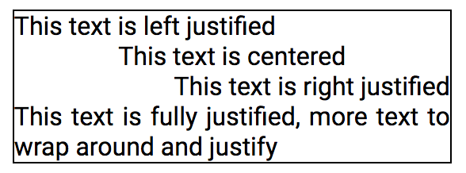

```html
<div class="ttl">This text is left justified</div>
<div class="ttc">This text is centered</div>
<div class="ttr">This text is right justified</div>
<div class="ttj">This text is fully justified, more text to wrap around and justify</div>
```

### Text vertical alignmen

```html
<div class="ttvt"> ... </div>
<div class="ttvm"> ... </div>
<div class="ttvbl"> ... </div>
<div class="ttvb"> ... </div>
```

### Text transformation styles

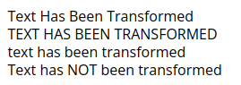

```html
<div class="tt-caps">text has been transformed</div>
<div class="tt-upcase">text has been transformed</div>
<div class="tt-lowcase">TEXT HAS BEEN TRANSFORMED</div>
<div class="tt-none">Text has NOT been transformed</div>
```

Style-Notation "**tt-none**" should be used to reset existing text style when they are not desired.

### Text wrapping

This control if wrapping should occur when text overflows its content box.

```html
<div class="tt-wrap"> ... </div>
<div class="tt-nowrap"> ... </div>
```

### Text overflow

```html
<div class="tt-overflow"> ... </div>
<div class="tt-overflow-auto"> ... </div>
<div class="tt-clip"> ... </div>
<div class="tt-scroll"> ... </div>
```

```html
<div class="tt-overflowy"> ... </div>
<div class="tt-overflowy-auto"> ... </div>
<div class="tt-clipy"> ... </div>
<div class="tt-scrolly"> ... </div>
```

```html
<div class="tt-overflowx"> ... </div>
<div class="tt-overflowx-auto"> ... </div>
<div class="tt-clipx"> ... </div>
<div class="tt-scrollx"> ... </div>
```

## Utility

Here are some useful Style-Notation.

### Visibility

Hide or show an element without affecting layout.

```html
<div class="visible"> ... </div>
<div class="invisible"> ... </div>
```

### Centering

Vertical, horizontal and full centering.

```html
<div class="centery"> ... </div>
<div class="centerx"> ... </div>
<div class="center"> ... </div>
```

## Display

You can hide and show the DOM node with the following styles. This will cause the element to be removed from the DOM and will affect layout.

All descendant elements of hidden element are also removed.

```html
<div class="show"> ... </div>
<div class="hide"> ... </div>
```

**Note:** Styles "**hide**" is an alias for "**d-none**".

```html
<div class="d-none"> ... </div>
<div class="d-inline"> ... </div>
<div class="d-inline-block"> ... </div>
<div class="d-block"> ... </div>
<div class="d-flex"> ... </div>
<div class="d-inline-flex"> ... </div>
<div class="d-grid"> ... </div>
<div class="d-inline-grid"> ... </div>
```

## Lists

Working with ordered and unorder lists.

### Bullet styles

```html
<div class="list-none"> ... </div>
<div class="list-disc"> ... </div>
<div class="list-circle"> ... </div>
<div class="list-square"> ... </div>
<div class="list-alpha"> ... </div>
<div class="list-roman"> ... </div>
<div class="list-decimal"> ... </div>
```

### Bullet placement

```html
<div class="list-inside"> ... </div>
<div class="list-outside"> ... </div>
```

## List orientation

```html
<div class="list-row"> ... </div>
<div class="list-col"> ... </div>
```

### List style reset

```html
<div class="list-reset"> ... </div>
```

## Floats

The long-form and its short-form.

```html
<div class="float-l"> ... </div>
<div class="float-r"> ... </div>
<div class="float-n"> ... </div>

<div class="fll"> ... </div>
<div class="flr"> ... </div>
<div class="fln"> ... </div>
```

### Clearfix

```html
<div class="cf"> ... </div>
```

## Lists

## Flexbox

The Flexbox Style-Notation make it easy to do layout.

### Direction

```html
<div class="flex-l"> ... </div>
<div class="flex-r"> ... </div>
<div class="flex-u"> ... </div>
<div class="flex-d"> ... </div>
```

### Wrap mode

```html
<div class="flex-wrap"> ... </div>
<div class="flex-nowrap"> ... </div>
<div class="flex-rwrap"> ... </div>
```

### Justify main axis

```html
<div class="flex-js"> ... </div>
<div class="flex-je"> ... </div>
<div class="flex-jc"> ... </div>
<div class="flex-ja"> ... </div>
<div class="flex-jb"> ... </div>
```

### Justify cross axis

```html
<div class="flex-is"> ... </div>
<div class="flex-ie"> ... </div>
<div class="flex-ic"> ... </div>
<div class="flex-ib"> ... </div>
<div class="flex-ix"> ... </div>
```

### Vertical align content

```html
<div class="flex-cs"> ... </div>
<div class="flex-ce"> ... </div>
<div class="flex-cc"> ... </div>
<div class="flex-cb"> ... </div>
<div class="flex-ca"> ... </div>
<div class="flex-cx"> ... </div>
```

### Item vertical align

```html
<div class="flex-sa"> ... </div>
<div class="flex-ss"> ... </div>
<div class="flex-se"> ... </div>
<div class="flex-sc"> ... </div>
<div class="flex-sb"> ... </div>
<div class="flex-sx"> ... </div>
```

### Ordering

```html
<div class="flex-1"> ... </div>
<div class="flex-2"> ... </div>
<div class="flex-3"> ... </div>
<div class="flex-4"> ... </div>
<div class="flex-5"> ... </div>
<div class="flex-6"> ... </div>
<div class="flex-7"> ... </div>
```

### Growing

```html
<div class="flex-grow1"> ... </div>
<div class="flex-grow2"> ... </div>
<div class="flex-grow3"> ... </div>
<div class="flex-grow4"> ... </div>
<div class="flex-grow5"> ... </div>
<div class="flex-grow6"> ... </div>
<div class="flex-grow7"> ... </div>
```

### Shrinking

```html
<div class="flex-shrink1"> ... </div>
<div class="flex-shrink2"> ... </div>
<div class="flex-shrink3"> ... </div>
<div class="flex-shrink4"> ... </div>
<div class="flex-shrink5"> ... </div>
<div class="flex-shrink6"> ... </div>
<div class="flex-shrink7"> ... </div>
```

## Grid

- WIP

## Responsive Design

- WIP
