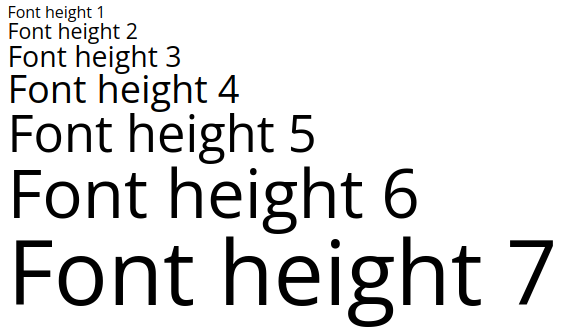
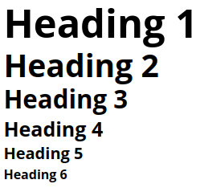
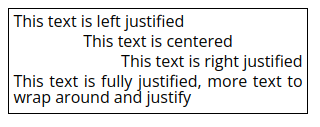

# Power Packed CSS Styling for Everyone!


[](https://greenkeeper.io/)


<!-- TOC -->

- [Introduction](#introduction)
- [CSS Resets](#css-resets)
- [Benefits](#benefits)
- [Basic usage](#basic-usage)
- [Setup](#setup)
  - [Starter HTML file](#starter-html-file)
  - [Install as NPM module](#install-as-npm-module)
  - [Using the CDN](#using-the-cdn)
  - [Tracking down CSS issues](#tracking-down-css-issues)
- [Mental model for Style-Notation](#mental-model-for-style-notation)
  - [Sacred Seven](#sacred-seven)
- [Box Model](#box-model)
- [CSS Borders](#css-borders)
  - [Border values](#border-values)
  - [Border](#border)
  - [Border top](#border-top)
  - [Border bottom](#border-bottom)
  - [Border left](#border-left)
  - [Border right](#border-right)
  - [Border top and bottom sides](#border-top-and-bottom-sides)
  - [Border left and right sides](#border-left-and-right-sides)
  - [Removing Borders](#removing-borders)
  - [Border Radius](#border-radius)
  - [Radius on all corners](#radius-on-all-corners)
  - [Corner Radius](#corner-radius)
  - [Face Radius](#face-radius)
  - [Border line style](#border-line-style)
  - [Circle Radius](#circle-radius)
  - [Pill styles Borders](#pill-styles-borders)
- [Positioning an Element](#positioning-an-element)
  - [Position](#position)
  - [Z-Index](#z-index)
- [Size](#size)
- [Spacing](#spacing)
- [Padding](#padding)
  - [Padding top](#padding-top)
  - [Padding bottom](#padding-bottom)
  - [Padding left](#padding-left)
  - [Padding right](#padding-right)
  - [Padding top and bottom sides](#padding-top-and-bottom-sides)
  - [Padding left and right sides](#padding-left-and-right-sides)
- [Margins](#margins)
- [Font](#font)
  - [Height scaling up](#height-scaling-up)
  - [Height scaling down](#height-scaling-down)
  - [Heading](#heading)
  - [Font styles](#font-styles)
  - [Font weight](#font-weight)
- [Text](#text)
  - [Text justification](#text-justification)
  - [Text vertical alignments](#text-vertical-alignments)
  - [Text transformation styles](#text-transformation-styles)
  - [Text wrapping](#text-wrapping)
  - [Text overflow](#text-overflow)
  - [Text Word break](#text-word-break)
  - [Text line height](#text-line-height)
  - [Text direction](#text-direction)
- [Utility](#utility)
  - [Visibility](#visibility)
  - [Opacity](#opacity)
  - [Centering](#centering)
- [Display](#display)
  - [General CSS display styles](#general-css-display-styles)
  - [CSS Table display styles](#css-table-display-styles)
  - [Table Caption placement](#table-caption-placement)
  - [Layout example](#layout-example)
- [Lists](#lists)
  - [Bullet marks](#bullet-marks)
  - [Bullet placement](#bullet-placement)
  - [List orientation](#list-orientation)
  - [List style reset](#list-style-reset)
- [Floats](#floats)
  - [Clearfix](#clearfix)
- [CSS Columns](#css-columns)
- [Flexbox](#flexbox)
  - [Flex Container](#flex-container)
  - [Flex direction](#flex-direction)
  - [Flex item flow](#flex-item-flow)
  - [Wrap mode](#wrap-mode)
  - [Justify Main Axis](#justify-main-axis)
  - [Justify Cross Axis](#justify-cross-axis)
  - [Align content Cross Axis](#align-content-cross-axis)
  - [Item align Cross Axis](#item-align-cross-axis)
  - [Flex ordering](#flex-ordering)
  - [Growing Flex item](#growing-flex-item)
  - [Shrinking Flex item](#shrinking-flex-item)
- [Grid](#grid)
- [Responsive Design](#responsive-design)

<!-- /TOC -->
## Introduction

Powerful CSS styling made simple, fast and fun!

__Dyno Might CSS__ (DM-CSS) is a concise CSS Style-Notation layout and design Toolkit. It is designed specifically to use simple and memorable Style-Notation that is specified as a "__class__" attribute.

Dyno Might CSS brings consistency to your HTML/JSX coding and allows for quick addtion of CSS styles that are easy to read.

Works with HTML, Angular, React and Vue.js.

## CSS Resets

Dyno Might CSS resets CSS styles using "__normalize.css__". In addition to this, the top __padding__ and __margin__ values are set to "__0__" (zero), to make calculation straight forward.

The global __Box Model__ is changed to use "__border-box__". This simplifies layout calculation since both margin and padding are contained inside the element's Box Model.

The Root Font family is set to "Roboto" with a height of __16px__. This base size is used to calculate the size of other elements by using the "__rem__" CSS unit.

## Benefits

Some of the features of __Dyno Might CSS__ Toolkit you will enjoy.

- Small size (25 KB).
- Fast loading and blazing execution.
- Robust compact Style-Notation.
- Easy to learn.
- Increased productivity.
- Designed for Designers, yet developer friendly!
- No side effects, works like your own custom CSS styles.
- Tested with hundreds of Test cases (394+).

## Basic usage

Dyno Might CSS Style-Notation are added as "__class__" attribute to an element's HTML Tag.

For example, let us say we want to center text and capitalize it. We also want a dashed border with a width of 20% of available space. The Style-Notation would look like the following.


```html
<div class="ttc ttcap b1 dash w20">centered text</div>
```

The Style-Notation read from left to right adds the following CSS styles.

1. Center text (text transform).
1. Text transform uppercase.
1. Draw a border 1px wide.
1. Set border line style to dashed (default is solid).
1. Set "__\<div\>__" element to take up 20% of available width.

Notice the power of Style-Notation and how it is additive, resulting in increased productivity. Context switching betweem HTLM/JSX and the CSS style sheet is eliminated for all core CSS styles.

## Setup

In the HTML root in the head section, it is a good idea to add the following responsive viewport meta tag.

```html
<meta name="viewport" content="width=device-width, initial-scale=1, shrink-to-fit=no">
```

Dyno Might CSS requires HTML5 doctype.

```html
<!doctype html>
<html lang="en">
  ...
</html>
```

### Starter HTML file

You may use the following HTML file to start from.

```html
<!doctype html>
<html lang="en">
  <head>
    <title>Dyno Might CSS</title>
    <!-- Required meta tags -->
    <meta charset="utf-8">
    <meta name="viewport" content="width=device-width, initial-scale=1, shrink-to-fit=no">

    <!-- DM-CSS Toolkit -->
    <link href="https://cdn.jsdelivr.net/npm/dm-css@2.0.0/css/dm.min.css" rel="stylesheet">
  </head>
  <body>
    <h1>Hello, Word Wide Web!</h1>
  </body>
</html>
```

There are two ways to install the Dyno Might CSS Toolkit as a dependency to your project.

1. Install as a NPM module.
1. Use the CDN.

### Install as NPM module

From a Node.js based project root, type:

```sh
npm install --save dm-css
```

### Using the CDN

To use the CDN, add the following __\<link\>__ Tag to your __index.html__ file, and enter the version of your choice.

__General format__

```html
<link href="https://cdn.jsdelivr.net/npm/dm-css@<version>/css/dm.min.css" rel="stylesheet">
```

Example usage for Dyno Might CSS version 2.0.0.

```html
<link href="https://cdn.jsdelivr.net/npm/dm-css@2.0.0/css/dm.min.css" rel="stylesheet">
```

### Tracking down CSS issues

If something seems off with the CSS, you can switch to using a non-compressed friendler CSS file for DM-CSS.

|CSS Files|Description|
|-|-|
|dm.css|Uncompressed CSS|
|dm.prefix.css|Uncompressed with vendor prefix added|
|dm.min.css|Compressed, for Production use|

## Mental model for Style-Notation

The Style-Notation is intentionally designed to be short, so one may be productive with less typing. When several notations are applied, this helps keep the overall line length much shoter than if long descriptive words were used for Style-Notation.

Here are some general __mnemonics__ used in the naming of Style-Notations.

|Mnemonic|Description|
|-|-|
|t|Top|
|b|Bottom|
|l|Left|
|r|Right|
|x|Left and right (horizontal), or expand (stretch) with Flexbox|
|y|Top and bottom (vertical)|


For each Style-Notation category, the mnemonic (key) will be listed to help with learning.

### Sacred Seven

Dyno Might CSS adhears to the "__Sacred Seven__" when it comes to value ranges. Almost all values range from 0 to 7. A value of zero "0", is used to reset or clear a style.

## Box Model

Dyno Might CSS defaults to using the "__border-box__" Box Model. You can however change this.

|Notation|Box model|Note|
|-|-|-|
|bbox|Border box|default|
|cbox|Content box| |

```html
<div class="cbox"> ... </div>
<div class="bbox"> ... </div>
```

__Recommendation__: Do not change the default Box Model for new projects, and never mix Box Models.

## CSS Borders

The Border Style-Notation provides the flexibility to add and remove borders.

- The default border line style is a solid line.

An element can be given borders on:

- All sides
- No sides
- One side (top, bottom, left ,right)
- Two sides (top-bottom or left-right)

### Border values

The postfix value for a border denotes the thickness of the border line.

- The supported values range from 0 to 7.

A value of "0" (zero) indicates no border. You would use it to remove borders from an element that may already have borders.

__Mnemonic__: b = border

|Notation|Values|Border sides|
|-|-|-|
|b|0-7|Border on all sides|
|bt|0-7|Border on top|
|bb|0-7|Border on bottom|
|bl|0-7|Border on left|
|br|0-7|Border on right|
|by|0-7|Border on top and bottom|
|bx|0-7|Border on left and right|

### Border

Border thickness value range from 0 to 7.


```html
<div class="b0"> ... </div>
<div class="b1"> ... </div>
<div class="b2"> ... </div>
<div class="b3"> ... </div>
<div class="b4"> ... </div>
<div class="b5"> ... </div>
<div class="b6"> ... </div>
<div class="b7"> ... </div>
```

### Border top

__Mnemonic__: b = border


```html
<div class="bt0"> ... </div>
<div class="bt1"> ... </div>
<div class="bt2"> ... </div>
<div class="bt3"> ... </div>
<div class="bt4"> ... </div>
<div class="bt5"> ... </div>
<div class="bt6"> ... </div>
<div class="bt7"> ... </div>
```

### Border bottom

__Mnemonic__: b = border


```html
<div class="bb0"> ... </div>
<div class="bb1"> ... </div>
<div class="bb2"> ... </div>
<div class="bb3"> ... </div>
<div class="bb4"> ... </div>
<div class="bb5"> ... </div>
<div class="bb6"> ... </div>
<div class="bb7"> ... </div>
```

### Border left

__Mnemonic__: b = border


```html
<div class="bl0"> ... </div>
<div class="bl1"> ... </div>
<div class="bl2"> ... </div>
<div class="bl3"> ... </div>
<div class="bl4"> ... </div>
<div class="bl5"> ... </div>
<div class="bl6"> ... </div>
<div class="bl7"> ... </div>
```

### Border right

__Mnemonic__: b = border


```html
<div class="br0"> ... </div>
<div class="br1"> ... </div>
<div class="br2"> ... </div>
<div class="br3"> ... </div>
<div class="br4"> ... </div>
<div class="br5"> ... </div>
<div class="br6"> ... </div>
<div class="br7"> ... </div>
```

### Border top and bottom sides

__Mnemonic__: b = border


```html
<div class="by0"> ... </div>
<div class="by1"> ... </div>
<div class="by2"> ... </div>
<div class="by3"> ... </div>
<div class="by4"> ... </div>
<div class="by5"> ... </div>
<div class="by6"> ... </div>
<div class="by7"> ... </div>
```

### Border left and right sides

__Mnemonic__: b = border


```html
<div class="bx0"> ... </div>
<div class="bx1"> ... </div>
<div class="bx2"> ... </div>
<div class="bx3"> ... </div>
<div class="bx4"> ... </div>
<div class="bx5"> ... </div>
<div class="bx6"> ... </div>
<div class="bx7"> ... </div>
```

### Removing Borders

There may be times you wish to remove a border from one or all sides. To do this, use a value of "0" (zero) with one of border Style-Notation.

__Mnemonic__: b = border

```html
<div class="b0"> ... </div>
<div class="bt0"> ... </div>
<div class="bb0"> ... </div>
<div class="bl0"> ... </div>
<div class="br0"> ... </div>
<div class="by0"> ... </div>
<div class="bx0"> ... </div>
```

You can use a combination of border styles to add then remove borders.

```html
<div class="b2 br0"> ... </div>
```

- Add borders to all sides and clear the border on the right side.


### Border Radius

Border corners can be given a radius value to round out the corners.

- The border radius values range from 0 to 7.
- This scale follows the Golden Ratio.

A radius value of "0" (zero) will reset "round" borders to have square corners.

__Mnemonic__: r = radius

|Notation|Values|Radius size|
|-|-|-|
|r|0-7|All radius|

### Radius on all corners


```html
<div class="b1 r0"> ... </div>
<div class="b1 r1"> ... </div>
<div class="b1 r2"> ... </div>
<div class="b1 r3"> ... </div>
<div class="b1 r4"> ... </div>
<div class="b1 r5"> ... </div>
<div class="b1 r6"> ... </div>
<div class="b1 r7"> ... </div>
```

Radius size is always consistent as shown below for larger dimensions.


### Corner Radius

You can set the border value for each individual corner using the following Style-Notation.

__Mnemonic__: r = radius

|Notation|Values|Border box corner|
|-|-|-|
|rtl|0-7|Top left|
|rtr|0-7|Top right|
|rbl|0-7|Bottom left|
|rbr|0-7|Bottom right|


```html
<div class="b1 rtl5">Top left radius</div>
<div class="b1 rtr5">Top right radius</div>
<div class="b1 rbl5">Bottom left radius</div>
<div class="b1 rbr5">Bottom right radius</div>
```

### Face Radius

The face radius covers each side of the Box Model to have round corners.

__Mnemonic__: r = radius

|Notation|Values|Border box face|
|-|-|-|
|rt|0-7|Top face|
|rb|0-7|Bottom face|
|rl|0-7|Left face|
|rr|0-7|Right face|


```html
<div class="b1 rt5">Radius top face</div>
<div class="b1 rb5">Radius bottom face</div>
<div class="b1 rl5">Radius left face</div>
<div class="b1 rr5">Radius right face</div>
```

### Border line style

Set border line style to dashed.

|Notation|Border box side|
|-|-|
|dash|All sides|
|dasht|Dash on top|
|dashb|Dash on bottom|
|dashl|Dash on left|
|dashr|Dash on right|
|dashy|Dash on top and bottom|
|dashx|Dash on left and right|


```html
<div class="b2 dash"> ... </div>
<div class="b2 dasht"> ... </div>
<div class="b2 dashb"> ... </div>
<div class="b2 dashl"> ... </div>
<div class="b2 dashr"> ... </div>
<div class="b2 dashx"> ... </div>
<div class="b2 dashy"> ... </div>
```

__Border dot__

Border line style dotted.

|Notation|Border box side|
|-|-|
|dot|All sides|
|dott|Dot on top|
|dotb|Dot on bottom|
|dotl|Dot on left|
|dotr|Dot on right|
|doty|Dot on top and bottom|
|datx|Dot on left and right|

```html
<div class="b2 dot"> ... </div>
<div class="b2 dott"> ... </div>
<div class="b2 dotb"> ... </div>
<div class="b2 dotl"> ... </div>
<div class="b2 dotr"> ... </div>
<div class="b2 dotx"> ... </div>
<div class="b2 doty"> ... </div>
```

### Circle Radius

To draw a circular border, use Style-Notation "__circle__".

You must include the border notation, "__b__", as it governs the border property on an element, whereas "__circle__" sets the border radius value.

- The "__circle__" notation uses a radius of 50%.

|Notation|Radius side|
|-|-|
|circle|All sides have a 50% radius value|

Below are three boxes with pixel dimensions of: 80x40, 80x80, 40x80.

```css
.box1 { width: 80px; height: 40px; }
.box2 { width: 80px; height: 80px; }
.box2 { width: 40px; height: 80px; }
```


```html
<div class="box1 b1 circle"> ... </div>
<div class="box2 b1 circle"> ... </div>
<div class="box3 b1 circle"> ... </div>
```

### Pill styles Borders

There are four pill styles for curved borders.

|Notation|Values|Pill shape|
|-|-|-|
|pill|1-4|Pill shared radius|


```html
<div class="b1 pill1"> ... </div>
<div class="b1 pill2"> ... </div>
<div class="b1 pill3"> ... </div>
<div class="b1 pill4"> ... </div>
```

## Positioning an Element

Most Browsers allow an element to be re-positioned relative to its default position, relative to another element, or fixed to a given location.

Dyno Might CSS makes positioning elements simple.

### Position

An element position property can be changed to one of the following CSS styles.

|Notation|Description|
|-|-|
|absolute|Position according to closest __relative__ positioned ancestor|
|fixed|Position relative to the Viewport|
|relative|Position relative to natural position using offset value|
|static|Default, use natural positioning|

```html
<span class="absolute"> ... </span>
<span class="fixed"> ... </span>
<span class="relative"> ... </span>
<span class="static"> ... </span>
```

Using fixed or absolute positioning.

|Notation|Position value|
|-|-|-|
|top|Top value of zero|
|bottom|Bottom value of zero|
|left|Left value of zero|
|right|Right value of zero|

```html
<span class="top"> ... </span>
<span class="bottom"> ... </span>
<span class="left"> ... </span>
<span class="right"> ... </span>
```

### Z-Index

Set the Z order of an element. Positive Z values move an element in-front of stacked elements, while negative Z value move an element behind stacked elements.

__Mnemonic__: z = Z-Index

|Notation|Values|Z Index|
|-|-|-|
|z|0-7|Positive Z order|
|z-|1-7|Negative Z order|
|zauto||Automatic positive Z order|

For automatic Z ordering, successive elements are given a positive increasing Z order.

```html
<span class="zauto"> ... </span>
```

The default Z-index value is 0, and goes up to 7.

__Pro tip__: Z indexing only work for elements with a position of "__relative__" or "__absolute__".

Positive Z-index values.

```html
<span class="z0"> ... </span>
<span class="z1"> ... </span>
<span class="z2"> ... </span>
<span class="z3"> ... </span>
<span class="z4"> ... </span>
<span class="z5"> ... </span>
<span class="z6"> ... </span>
<span class="z7"> ... </span>
```

Negative Z-index values.

```html
<span class="z-1"> ... </span>
<span class="z-2"> ... </span>
<span class="z-3"> ... </span>
<span class="z-4"> ... </span>
<span class="z-5"> ... </span>
<span class="z-6"> ... </span>
<span class="z-7"> ... </span>
```

## Size

Set the size of the element "__viewport__".

Scale values for width and height range from 10% to 100% and incremented by 10.

__Mnemonic__: w = width, h = height

|Notation|Values|Description|
|-|-|-|
|w|10-100|Set width percentage|
|h|10-100|Set height percentage|
|wmin|10-100|Set minimum width percentage|
|wmax|10-100|Set maximum width percentage|
|hmin|10-100|Set minimum height percentage|
|hmax|10-100|Set maximum height percentage|

```html
<div class="w10"> ... </div>
<div class="w20"> ... </div>
<div class="w30"> ... </div>
<div class="w40"> ... </div>
<div class="w50"> ... </div>
<div class="w60"> ... </div>
<div class="w70"> ... </div>
<div class="w80"> ... </div>
<div class="w90"> ... </div>
<div class="w100"> ... </div>
```

Clear and reset an element's minimum and maximum Viewport size.

__Mnemonic__: w = width, h = height

|Notation|Size dimension reset|
|-|-|
|hauto|Height set to auto|
|wauto|Width set to auto|
|hnomax|Height has no max value|
|wnomax|Width has no max value|

```html
<div class="hauto"> ... </div>
<div class="wauto"> ... </div>
<div class="hnomax"> ... </div>
<div class="wnomax"> ... </div>
```

## Spacing

The Box Model that Dyno Might CSS uses is "__border-box__". For more info on Box Model see [MDN box-sizing](https://developer.mozilla.org/en-US/docs/Web/CSS/box-sizing).


The Style-Notation for spacing allows setting the __margin__ and __padding__ used by an element.

- Padding and margin scale values range from 0 to 7.
- Scale values follow the Golden Ratio.

__Sizing Pro Tip__

In CSS, inline elements like "__\<span\>__" or "__\<i\>__" inherit their height values for margin and padding from surrounding text. The height value for margin or padding for an __inline__ element cannot be changed. To be able to change these properties, you must change their display property from "__inline__" to "__inline-block__".

```html
<span class="d-inline-block"> ... </span>
```

Make sure you have a good understanding of CSS display types. How block and inline elements get rendered and ultimately how this will affect setting their width and height. Otherwise this can lead to some confusion as it will seem as the style changes are not working.

## Padding

__Mnemonic__: p = padding

|Notation|Values|Box side|
|-|-|-|
|p|0-7|Pad all sides|
|pt|0-7|Pad top|
|pb|0-7|Pad bottom|
|pl|0-7|Pad left|
|pr|0-7|Pad right|
|py|0-7|Pad top and bottom|
|px|0-7|Pad left and right|

Add padding to all sides, values range from 0 to 7 and follow the Golden Ratio.

```html
<div class="p0">Padding size 0</div>
<div class="p1">Padding size 1</div>
<div class="p2">Padding size 2</div>
<div class="p3">Padding size 3</div>
<div class="p4">Padding size 4</div>
<div class="p5">Padding size 5</div>
<div class="p6">Padding size 6</div>
<div class="p7">Padding size 7</div>
```

### Padding top


__Mnemonic__: p = padding

```html
<div class="pt0">Padding top size 0</div>
<div class="pt1">Padding top size 1</div>
<div class="pt2">Padding top size 2</div>
<div class="pt3">Padding top size 3</div>
<div class="pt4">Padding top size 4</div>
<div class="pt5">Padding top size 5</div>
<div class="pt6">Padding top size 6</div>
<div class="pt7">Padding top size 7</div>
```

### Padding bottom


__Mnemonic__: p = padding

```html
<div class="pb0">Padding bottom size 0</div>
<div class="pb1">Padding bottom size 1</div>
<div class="pb2">Padding bottom size 2</div>
<div class="pb3">Padding bottom size 3</div>
<div class="pb4">Padding bottom size 4</div>
<div class="pb5">Padding bottom size 5</div>
<div class="pb6">Padding bottom size 6</div>
<div class="pb7">Padding bottom size 7</div>
```

### Padding left


__Mnemonic__: p = padding

```html
<div class="pl0">Padding left size 0</div>
<div class="pl1">Padding left size 1</div>
<div class="pl2">Padding left size 2</div>
<div class="pl3">Padding left size 3</div>
<div class="pl4">Padding left size 4</div>
<div class="pl5">Padding left size 5</div>
<div class="pl6">Padding left size 6</div>
<div class="pl7">Padding left size 7</div>
```

### Padding right


__Mnemonic__: p = padding

```html
<div class="pr0">Padding right size 0</div>
<div class="pr1">Padding right size 1</div>
<div class="pr2">Padding right size 2</div>
<div class="pr3">Padding right size 3</div>
<div class="pr4">Padding right size 4</div>
<div class="pr5">Padding right size 5</div>
<div class="pr6">Padding right size 6</div>
<div class="pr7">Padding right size 7</div>
```

### Padding top and bottom sides


__Mnemonic__: p = padding

```html
<span class="py0">Padding top and bottom size 0</span>
<span class="py1">Padding top and bottom size 1</span>
<span class="py2">Padding top and bottom size 2</span>
<span class="py3">Padding top and bottom size 3</span>
<span class="py4">Padding top and bottom size 4</span>
<span class="py5">Padding top and bottom size 5</span>
<span class="py6">Padding top and bottom size 6</span>
<span class="py7">Padding top and bottom size 7</span>
```

### Padding left and right sides


__Mnemonic__: p = padding

```html
<span class="px0">Padding left and right size 0</span>
<span class="px1">Padding left and right size 1</span>
<span class="px2">Padding left and right size 2</span>
<span class="px3">Padding left and right size 3</span>
<span class="px4">Padding left and right size 4</span>
<span class="px5">Padding left and right size 5</span>
<span class="px6">Padding left and right size 6</span>
<span class="px7">Padding left and right size 7</span>
```

## Margins

Set the margin area surrounding an element.

__Mnemonic__: m = margin

|Notation|Values|Box side|
|-|-|-|
|m|0-7|Margin all sides|
|mt|0-7|Margin top|
|mb|0-7|Margin bottom|
|ml|0-7|Margin left|
|mr|0-7|Margin right|
|my|0-7|Margins top and bottom|
|mx|0-7|Margins left and right|

Add margin to all sides, size values range from 0 to 7 and follow the Golden Ratio.

```html
<div class="m0">Margin size 0</div>
<div class="m1">Margin size 1</div>
<div class="m2">Margin size 2</div>
<div class="m3">Margin size 3</div>
<div class="m4">Margin size 4</div>
<div class="m5">Margin size 5</div>
<div class="m6">Margin size 6</div>
<div class="m7">Margin size 7</div>
```

By setting margin to auto, size is determined from available space.

__Mnemonic__: m = margin

|Notation|Box side|
|-|-|
|mxa|Auto margins left and right|
|mla|Auto margins left |
|mra|Auto margins right|

```html
<div class="mxa">Auto</div>
<div class="mla">Auto left</div>
<div class="mra">Auto right</div>
```

## Font

Font heights follows the "__Perfect Third__" scale, ranging from 1 to 7.

A font scale of 1 has a font height equal to the root element, which is set to 16px from the font family of Roboto (unless changed).

__Mnemonic__: fh = Font height

|Notation|Values|Font scaling|
|-|-|-|
|fh |1-7|Increase font size|
|fh-|1-7|Reduce font size|
|h  |1-7|Shrink Heading size|

### Height scaling up

Higher scale values result in progressively larger fonts. Note this is the reverse of HTML heading values.



```html
<div class="fh1">Font height 1</div>
<div class="fh2">Font height 2</div>
<div class="fh3">Font height 3</div>
<div class="fh4">Font height 4</div>
<div class="fh5">Font height 5</div>
<div class="fh6">Font height 6</div>
<div class="fh7">Font height 7</div>
```

### Height scaling down

When a font height is scaled down, the values become a fraction of the root font height.

The negative scale reduces font height successively by a factor of __10%__.

You will notice in the Style-Notation, scaled down fonts have a leading "-" dash before the value, this can be consider negative scaled values.


__Mnemonic__: fh = Font height

```html
<div class="fh-1">Font height 1</div>
<div class="fh-2">Font height 2</div>
<div class="fh-3">Font height 3</div>
<div class="fh-4">Font height 4</div>
<div class="fh-5">Font height 5</div>
<div class="fh-6">Font height 6</div>
<div class="fh-7">Font height 7</div>
```

### Heading

There are also 7 Heading Style-Notations, which display as the regular HTML heading tags.

- Headings have been changed to use the "__Major Third__" scale.
- For headings you can also use the regular HTML __h1__ to __h6__ tags.



```html
<div class="h1">Font height 1</div>
<div class="h2">Font height 2</div>
<div class="h3">Font height 3</div>
<div class="h4">Font height 4</div>
<div class="h5">Font height 5</div>
<div class="h6">Font height 6</div>
<div class="h7">Font height 7</div>

<h1>Heading 1</h1>
<h2>Heading 2</h2>
<h3>Heading 3</h3>
<h4>Heading 4</h4>
<h5>Heading 5</h5>
<h6>Heading 6</h6>
```

__Note__: Style-Notation provides and extra heading value for __h7__.

### Font styles

__Mnemonic__: fs = Font style

|Notation|Font style|
|-|-|
|fsn|Font style none, reset all styles|
|fsb|Bold|
|fsi|Italic|
|fsu|Underline|
|fss|Strike-through|
|fsw|Wavy underline|


```html
<div class="fsn">Font style none</div>
<div class="fsb">Font style bold</div>
<div class="fsi">Font style italic</div>
<div class="fsu">Font style underline</div>
<div class="fss">Font style strike-through</div>
<div class="fsw">Font style wavy underline</div>
```

### Font weight

The font weight depends on the font being used. The weight determines the thickness of the displayed characters.

The weight range is from 100 to 900, and increases thickness (thin to think). Not all values maybe be valid, as it depends on the font set being used.

__Note__: Values increment by 100.

__Mnemonic__: fw = Font weight

|Notation|Values|Font weight|
|-|-|-|
|fw|100-900|Set the font boldness (thickness) value|

```html
<div class="fw100"> ... </div>
<div class="fw200"> ... </div>
<div class="fw300"> ... </div>
<div class="fw400"> ... </div>
<div class="fw500"> ... </div>
<div class="fw600"> ... </div>
<div class="fw700"> ... </div>
<div class="fw800"> ... </div>
<div class="fw900"> ... </div>
```

## Text

Here are a few handy CSS styles for working with text.

### Text justification

The following Style-Notations are used to justify text.

__Mnemonic__: tt = Text transform

|Notation|Text transform|
|-|-|
|ttl|Left justify text|
|ttc|Center text|
|ttr|Right justify text|
|ttj|Justify multi-line text|



```html
<div class="ttl">This text is left justified</div>
<div class="ttc">This text is centered</div>
<div class="ttr">This text is right justified</div>
<div class="ttj">This text is fully justified, more text to wrap around and justify</div>
```

__Note__: For text justification to work, the text must span multiple lines.

### Text vertical alignments

Specify the vertical alignment of an inline or table-cell box.

__Mnemonic__: tt = Text transform

|Notation|Description|
|-|-|
|ttvt|Vertical align top|
|ttvm|Vertical align middle|
|ttvbl|Vertical align baseline|
|ttvb|Vertical align bottom|
|ttvtt|Vertical align text top|
|ttvtb|Vertical align text bottom|
|ttsub|Vertical align sub-script|
|ttsuper|Vertical align super-script|

```html
<div class="ttvt"> ... </div>
<div class="ttvm"> ... </div>
<div class="ttvbl"> ... </div>
<div class="ttvb"> ... </div>
<div class="ttvtt"> ... </div>
<div class="ttvtb"> ... </div>
<div class="ttsub"> ... </div>
<div class="ttsuper"> ... </div>
```

### Text transformation styles


__Mnemonic__: tt = Text transform

|Notation|Text transform|
|-|-|
|ttcaps|Capitalize text|
|ttup|Make all text upper-case|
|ttlow|Mark all text lower-case|
|ttnone|Remove any text transform previously set|

```html
<div class="ttcaps">text has been transformed</div>
<div class="ttup">text has been transformed</div>
<div class="ttlow">TEXT HAS BEEN TRANSFORMED</div>
<div class="ttnone">Text has NOT been transformed</div>
```

Style-Notation "__ttnone__" should be used to reset existing text style when they are not desired.

### Text wrapping

Control if wrapping should occur when text overflows its Viewport.

__Mnemonic__: tt = Text transform

|Notation|Text flow mode|
|-|-|
|ttwrap|Wrap text outside its Viewport|
|ttnowrap|Allow text to flow outside its Viewport|

```html
<div class="ttwrap"> ... </div>
<div class="ttnowrap"> ... </div>
```

### Text overflow

Specify text overflow behaviour when it is bigger than its display Viewport.

__Mnemonic__: tt = Text transform

|Notation|Text flow mode|
|-|-|
|ttof|Allow text to overflow Viewport|
|ttofa|Add a scroll-bar when text overflows|
|ttclip|Hide overflowed text outside Viewport|
|ttscroll|Add a scroll-bar when text overflows|

```html
<div class="ttof"> Allow overflow </div>
<div class="ttofa"> Add scroll-bar when needed </div>
<div class="ttclip"> Clip text outside Viewport </div>
<div class="ttscroll"> Add scroll-bar </div>
```

Text overflow control for vertical direction, when lines wrap around.

__Mnemonic__: tt = Text transform

|Notation|Text vertical flow mode|
|-|-|
|ttofy|Allow text to overflow Viewport|
|ttofya|Add a scroll-bar when text overflows|
|ttclipy|Hide overflowed text outside Viewport|
|ttscrolly|Add a scroll-bar when text overflows|

```html
<div class="ttofy"> ... </div>
<div class="ttofya"> ... </div>
<div class="ttclipy"> ... </div>
<div class="ttscrolly"> ... </div>
```

Text overflow control for horizontal direction.

__Mnemonic__: tt = Text transform

|Notation|Text horizontal flow mode|
|-|-|
|ttofx|Allow text to overflow Viewport|
|ttofxa|Add a scroll-bar when text overflows|
|ttclipx|Hide overflowed text outside Viewport|
|ttscrollx|Add a scroll-bar when text overflows|

```html
<div class="ttofx"> ... </div>
<div class="ttofxa"> ... </div>
<div class="ttclipx"> ... </div>
<div class="ttscrollx"> ... </div>
```

### Text Word break

Control how breaking occurs when end of line is reached.

__Mnemonic__: tt = Text transform

|Notation|Text word break|
|-|-|
|ttwb|Break word on space|
|ttwba|Word with no space will be broken|

```html
<div class="ttwb"> The Fox jumped over the lazy sleeping Dog. </div>
<div class="ttwba"> Supercalifragilisticexpialidocious </div>
```

### Text line height

Set the line height.

__Mnemonic__: tt = Text transform

|Notation|Values|Line height|
|-|-|-|
|ttlh|0-7|Increase line height|
|ttlh-|1-7|Reduce line height|

Increasing line heights.

```html
<div class="ttlh0"> ... </div>
<div class="ttlh1"> ... </div>
<div class="ttlh2"> ... </div>
<div class="ttlh3"> ... </div>
<div class="ttlh4"> ... </div>
<div class="ttlh5"> ... </div>
<div class="ttlh6"> ... </div>
<div class="ttlh7"> ... </div>
```

Decreasing line heights.

```html
<div class="ttlh-1"> ... </div>
<div class="ttlh-2"> ... </div>
<div class="ttlh-3"> ... </div>
<div class="ttlh-4"> ... </div>
<div class="ttlh-5"> ... </div>
<div class="ttlh-6"> ... </div>
<div class="ttlh-7"> ... </div>
```

### Text direction

Set the direction of text based on language in use.

|Notation|Text direction|
|-|-|
|ltr|Left of right|
|rtl|Right to left|

```html
<div class="ltr"> ... </div>
<div class="rtl"> ... </div>
```

## Utility

Here are some useful Style-Notation.

### Visibility

Hide or show an element without affecting layout. Other displayed elements will not get re-positioned.

|Notation|Visibility|
|-|-|
|visible|Display element and its descendants|
|invisible|Hide element and its descendants|

```html
<div class="visible"> ... </div>
<div class="invisible"> ... </div>
```

### Opacity

Control the opacity of an element and its descendants. A value of "0" (zero), is not visible, and a value of 7 is completely visible.

|Notation|Value|Opacity|
|-|-|-|
|opacity|0-7|Higher value is more opaque (visible)|

```html
<div class="opacity0"> ... </div>
<div class="opacity1"> ... </div>
<div class="opacity2"> ... </div>
<div class="opacity3"> ... </div>
<div class="opacity4"> ... </div>
<div class="opacity5"> ... </div>
<div class="opacity6"> ... </div>
<div class="opacity7"> ... </div>
```

### Centering

Vertical, horizontal and full centering elements inside the container.

|Notation|Centering|
|-|-|
|center|Center vertically|
|centery|Center vertically and horizontally|
|centerx|Center horizontally|

```html
<div class="center"> ... </div>
<div class="centery"> ... </div>
<div class="centerx"> ... </div>
```

## Display

You can hide and show the DOM element with the following styles. This will cause the element to be removed from the DOM and will affect layout. All descendant elements of hidden element are also removed.

|Notation|Visibility|
|-|-|
|show|Add and display element and its descendants|
|hide|Hide and remove element and its descendants|

```html
<div class="show"> ... </div>
<div class="hide"> ... </div>
```

__Note:__ Styles "__hide__" is an alias for "__dnone__", prefer to use __hide__ as it is more clear what we expect to happen.

### General CSS display styles

__Mnemonic__: d = display

|Notation|CSS display style|
|-|-|
|dnone|none|
|dinline|inline|
|diblock|inline-block|
|dblock|block|
|dflex|flex|
|diflex|inline-flex|
|dgrid|grid|
|digrid|inline-grid|

```html
<div class="dnone"> ... </div>
<div class="dinline"> ... </div>
<div class="diblock"> ... </div>
<div class="dblock"> ... </div>
<div class="dflex"> ... </div>
<div class="diflex"> ... </div>
<div class="dgrid"> ... </div>
<div class="digrid"> ... </div>
```

### CSS Table display styles

Pure CSS table layout Style-Notation works like its HTML table counterpart, without the additional tags. This makes the HTML cleaner and less busy.

__Mnemonic__: t = table

|Notation|CSS Table display style|
|-|-|
|table|table|
|tr|table-row|
|td|table-cell|
|tcap|table-caption|
|tcol|table-column|
|tcolgroup|table-column-group|
|thead|table-header-group|
|tbody|table-row-group|
|tfoot|table-footer-group

```html
<div class="table"> ... </div>
<div class="tr"> ... </div>
<div class="td"> ... </div>
<div class="tcap"> ... </div>
<div class="tcol"> ... </div>
<div class="tcolgroup"> ... </div>
<div class="thead"> ... </div>
<div class="tbody"> ... </div>
<div class="tfoot"> ... </div>
```

### Table Caption placement

__Mnemonic__: tcap = table caption

|Notation|CSS Table caption|
|-|-|
|tcapt|Caption top|
|tcapb|Caption bottom|

```html
<div class="tcapt"> ... </div>
<div class="tcapb"> ... </div>
```

### Layout example

Using CSS table to layout a HTML Form.


```html
<div class="bg w30 m4">
  <form class="table w100 pr4">
    <p class="tcap ml3 pt3">Enter your full name and age.</p>
    <div class="tr">
      <label class="pl3 td wauto" for="fname">First name:</label>
      <input class="td w100" type="text" id="fname">
    </div>
    <div class="tr">
      <label class="pl3 td wauto" for="lname">Last name:</label>
      <input class="td w100" type="text" id="lname">
    </div>
    <div class="tr">
      <label class="pl3 td wauto" for="age">Age:</label>
      <input class="td w100" type="text" id="age">
    </div>
    <div class="tr ttr">
      <span class="td"></span>
      <button class="td">Save</button>
    </div>
  </form>
</div>
```

## Lists

Styles to apply to both order and un-ordered list and list items.

### Bullet marks

__Mnemonic__: ls = List style

|Notation|Bullet style|
|-|-|
|lsnone|No bullet|
|lsdisc|Dot shaped bullet|
|lscircle|Circle outlined bullet|
|lssquare|Square shaped bullet|
|lsalpha|Lower case alpha bullets|
|lsroman|Lower case Roman numbers bullets|
|lsdecimal|Counting number bullets|

```html
<div class="lsnone"> ... </div>
<div class="lsdisc"> ... </div>
<div class="lscircle"> ... </div>
<div class="lssquare"> ... </div>
<div class="lsalpha"> ... </div>
<div class="lsroman"> ... </div>
<div class="lsdecimal"> ... </div>
```

### Bullet placement

Placement of the bullet for list items.

__Mnemonic__: ls = List style

|Notation|Bullet placement|
|-|-|
|lsin|Bullet placed on the inside|
|lsout|Bullet placed on the outside|

```html
<div class="lsin"> Inside </div>
<div class="lsout"> Outside </div>
```

### List orientation

Change list orientation and hide bullets.

__Mnemonic__: ls = List style

|Notation|List orientation|
|-|-|
|lsrow|Display list along a row (horizontal)|
|lscol|Display list down a column (vertical)|

```html
<div class="lsrow"> Horizontal without bullets </div>
<div class="lscol"> Vertical without bullets </div>
```

### List style reset

Reset list style, undo applied list style.

__Mnemonic__: ls = List style

|Notation|Description|
|-|-|
|lsreset|Clear list to its default|

```html
<div class="lsreset"> ... </div>
```

## Floats

Positioning element by floating to one side.

__Mnemonic__: fl = float

|Notation|Float direction|
|-|-|-|
|fll|Float left|
|flr|Float right|
|fln|Float none|

```html
<div class="fll"> ... </div>
<div class="flr"> ... </div>
<div class="fln"> ... </div>
```

__Pro Tip__: Use display "__inline-block__" to avoid having to use "__clear__" when working with "__float__".

### Clearfix

Apply clearfix settings.

|Notation|Description|
|-|-|-|
|cf| Clearfix|

```html
<div class="cf"> ... </div>
```

## CSS Columns

Columns are the fast and simple way to work with text layout as seen in publications. You can decide between using fixed width column counts, or dynamic width column count.

__Mnemonic__: col = column

|Notation|Values|Description|
|-|-|-|
|col|1-7|Dynamic size, fixed columns|
|colf|1-7|Fixed width dimension based columns|
|colgap|0-7|Gap size between columns|
|colauto||Set column width to auto|
|colsa||Column span all|

__Example__: Text using 3 columns.


If you want a fixed number of columns that vary in width based on its container size, use "__col__".

If you want to maintain a fixed width for each column, and have the column count determined by the size of its container, use "__colf__".

## Flexbox

The Style-Notation for Flexbox makes it easy to do layout.

### Flex Container

To create a Flex container, you must change the display property.

__Mnemonic__: d = display

|Notation|CSS Display|
|-|-|
|dflex|Flex|
|diflex|Inline flex|

Making descendent items flex or inline flex items.

```html
<div class="dflex"> ... </div>
<div class="diflex"> ... </div>
```

### Flex direction

The default __Main__ and __Cross__ axis look like this.


Using the direction Style-Notations, will change the direction of the __Main__ and __Cross__ axis.

__Mnemonic__: fb = Flexbox

|Notation|Flex direction|Main Axis direction|
|-|-|-|
|fbr|Row (right)|Left to right|
|fbl|Row reverse (left)|Right to left|
|fbu|Column reverse (up)|Bottom to top|
|fbd|Column (down)|Top to bottom|

__Note__: The Cross axis is always perpendicular to Main axis.

```html
<div class="fbr"> ... </div>
<div class="fbl"> ... </div>
<div class="fbu"> ... </div>
<div class="fbd"> ... </div>
```

### Flex item flow


### Wrap mode

Additional notation to use for a multi-line Flex container. This will control Flex wrapping mode, items determine too long to fit the line can be set to wrap onto a new line.

__Mnemonic__: fb = Flexbox

|Notation|Wrap mode|
|-|-|
|fbw|Flex wrap|
|fbnw|Flex no wrap|
|fbrw|Flex reverse wrap|

```html
<div class="fbw"> ... </div>
<div class="fbnw"> ... </div>
<div class="fbrw"> ... </div>
```

### Justify Main Axis

Justify Flex items along the Main axis.

__Mnemonic__: fb = Flexbox

|Notation|Justification along Main Axis|
|-|-|
|fbjs|Justify start|
|fbje|Justify end|
|fbjc|Justify center|
|fbja|Justify space around|
|fbjb|Justify space between|


```html
<div class="fbjs"> ... </div>
<div class="fbje"> ... </div>
<div class="fbjc"> ... </div>
<div class="fbja"> ... </div>
<div class="fbjb"> ... </div>
```

### Justify Cross Axis

Vertically justify Flex items along their Cross axis.

__Mnemonic__: fb = Flexbox

|Notation|Justification Cross Axis|
|-|-|
|fbis|Justify items start|
|fbie|Justify items end|
|fbic|Justify items center|
|fbib|Justify items baseline|
|fbix|Justify items stretch (eXpand)|


```html
<div class="fbis"> ... </div>
<div class="fbie"> ... </div>
<div class="fbic"> ... </div>
<div class="fbib"> ... </div>
<div class="fbix"> ... </div>
```

### Align content Cross Axis

Justify all Flex items inside a Flex container.

__Mnemonic__: fb = Flexbox

|Notation|Content alignment|
|-|-|
|fbcs|Align content start|
|fbce|Align content end|
|fbcc|Align content center|
|fbca|Align content space around|
|fbcb|Align content space between|
|fbcx|Align content stretch (eXpand)|


```html
<div class="fbcs"> ... </div>
<div class="fbce"> ... </div>
<div class="fbcc"> ... </div>
<div class="fbca"> ... </div>
<div class="fbcb"> ... </div>
<div class="fbcx"> ... </div>
```

### Item align Cross Axis

Justify single Flex item along the Cross axis.

__Mnemonic__: fb = Flexbox

|Notation|Item self alignment|
|-|-|
|fbss|Align self start|
|fbse|Align self end|
|fbsc|Align self center|
|fbsb|Align self baseline|
|fbsx|Align self stretch (eXpand)|
|fbsa|Align self auto|


```html
<div class="fbss"> ... </div>
<div class="fbse"> ... </div>
<div class="fbsc"> ... </div>
<div class="fbsb"> ... </div>
<div class="fbsx"> ... </div>
<div class="fbsa"> ... </div>
```

### Flex ordering

Flex items position ordering.

__Mnemonic__: fb = Flexbox

|Notation|Values|Flex item order|
|-|-|-|
|fbo|0-7|Flex item positive order|
|fbo-|1-7|Flex item negative order|

```html
<div class="fbo1"> ... </div>
<div class="fbo2"> ... </div>
<div class="fbo3"> ... </div>
<div class="fbo4"> ... </div>
<div class="fbo5"> ... </div>
<div class="fbo6"> ... </div>
<div class="fbo7"> ... </div>
```

__Example__: Flex item ordering.


```html
<div class="fbo3">A</div>
<div class="fbo1">B</div>
<div class="fbo2">C</div>
```

Negative order positions.

```html
<div class="fbo-1"> ... </div>
<div class="fbo-2"> ... </div>
<div class="fbo-3"> ... </div>
<div class="fbo-4"> ... </div>
<div class="fbo-5"> ... </div>
<div class="fbo-6"> ... </div>
<div class="fbo-7"> ... </div>
```

### Growing Flex item

Grow a Flexbox item.

__Mnemonic__: fb = Flexbox

|Notation|Values|Descriptioon|
|-|-|-|
|fb|0-7|Flex item grow|

```html
<div class="fb0"> ... </div>
<div class="fb1"> ... </div>
<div class="fb2"> ... </div>
<div class="fb3"> ... </div>
<div class="fb4"> ... </div>
<div class="fb5"> ... </div>
<div class="fb6"> ... </div>
<div class="fb7"> ... </div>
```

__Example__: Sizing Flex items.


```html
<div class="fb0">A</div>
<div class="fb1">B</div>
<div class="fb2">C</div>
```

### Shrinking Flex item

Shrink a Flexbox item.

__Mnemonic__: fb = Flexbox

|Notation|Values|Description|
|-|-|-|
|fb-|1-7|Flex item shrink|

```html
<div class="fb-1"> ... </div>
<div class="fb-2"> ... </div>
<div class="fb-3"> ... </div>
<div class="fb-4"> ... </div>
<div class="fb-5"> ... </div>
<div class="fb-6"> ... </div>
<div class="fb-7"> ... </div>
```

## Grid

- WIP

## Responsive Design

- WIP
