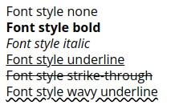

# DM-CSS a CSS Toolkit for everyone
<!-- TOC -->

- [Introduction](#introduction)
- [CSS Resets](#css-resets)
  - [Benefits](#benefits)
  - [Basic usage](#basic-usage)
- [Setup](#setup)
  - [Starter HTML file](#starter-html-file)
  - [Install as NPM module](#install-as-npm-module)
  - [Use the CDN](#use-the-cdn)
- [CSS Borders](#css-borders)
  - [Border values](#border-values)
  - [Border Style-Notation](#border-style-notation)
  - [Border top](#border-top)
  - [Border bottom](#border-bottom)
  - [Border left](#border-left)
  - [Border right](#border-right)
  - [Border left-right sides](#border-left-right-sides)
  - [Border top-bottom sides](#border-top-bottom-sides)
  - [Removing Borders](#removing-borders)
- [Border radius](#border-radius)
  - [Corner radius](#corner-radius)
  - [Equale radius corners](#equale-radius-corners)
  - [Corner radius](#corner-radius-1)
  - [Side face radius](#side-face-radius)
  - [Border line style](#border-line-style)
  - [Circle radius](#circle-radius)
  - [Pill styles borders](#pill-styles-borders)
- [Position](#position)
  - [Z-Index](#z-index)
- [Size](#size)
- [Spacing](#spacing)
  - [Padding](#padding)
  - [Padding top](#padding-top)
  - [Padding bottom](#padding-bottom)
  - [Padding left](#padding-left)
  - [Padding right](#padding-right)
  - [Padding Y](#padding-y)
  - [Padding X](#padding-x)
  - [Margins](#margins)
- [Font](#font)
  - [Height scaling up](#height-scaling-up)
  - [Height scaling down](#height-scaling-down)
  - [Font styles](#font-styles)
  - [Font weight](#font-weight)
- [Text](#text)
  - [Text justification](#text-justification)
  - [Text transformation styles](#text-transformation-styles)
  - [Text overflow wrapping](#text-overflow-wrapping)
- [Utility](#utility)
- [Display](#display)
- [Flexbox](#flexbox)
- [Grid](#grid)

<!-- /TOC -->
## Introduction

Powerful CSS styling made simple, fast and fun!

DM-CSS is a Style-Notation CSS layout and design Toolkit.

It brings consistency to your Web page coding and allows you to quickly add CSS styles that are easy to read.

## CSS Resets

DM-CSS resets CSS style setting using "normalize.css" a well accepted cross-browser library. It also set top padding and margin values to "0" (zero), as this make calculation straight forward.

The global box model is changed to use border-box, this make it easy for calculation and does not allow margin and padding value to grow the box size.

The Root font family is set to "Roboto" with a height of 16px. This is the base (root) value other CSS heights are calculated off using the "**rem**" CSS unit.

### Benefits

Some of the features of DM-CSS Toolkit you will enjoy right away.

- Small size
- Fast loading
- Robust and compact Style-Notation.
- Consistent, easy to use and learn.
- Designed for Designer, yet developer friendly!
- No side effect, works like your own custom CSS styles.

### Basic usage

DM-CSS Style-Notation are added to the "**class**" attribute of the HTML Tag.

For example if you want to center text and capitalize it, the Style-Notation would look like the following.

```html
<div class="ttc tt-upcase b1 dash w20">centered text</div>
```


The Style-Notation read from left to right above adds the following CSS styles.

1. Text transform center.
1. Text transform uppercase.
1. Draw a border 1px wide.
1. Set border line style to dashed (default is solid).
1. Set div element to take up 20% of the available width.

As you can see DM-CSS Style-Notation are powerful and can be combined together to increase productivity.

## Setup

In your root HTML file, it is a good idea to add the following responsive viewport meta tag.

```html
<meta name="viewport" content="width=device-width, initial-scale=1, shrink-to-fit=no">
```

DM-CSS requires HTML5 doctype.

```html
<!doctype html>
<html lang="en">
  ...
</html>
```

### Starter HTML file

You can use the following HTML file to start off with.

```html
<!doctype html>
<html lang="en">
  <head>
    <title>Hello, world!</title>
    <!-- Required meta tags -->
    <meta charset="utf-8">
    <meta name="viewport" content="width=device-width, initial-scale=1, shrink-to-fit=no">

    <!-- DM-CSS Toolkit -->
    <link href="https://cdn.jsdelivr.net/npm/dm-css@0.0.4/css/dm.min.css" rel="stylesheet">
  </head>
  <body>
    <h1>Hello, Inter-Web!</h1>
  </body>
</html>
```

There are two ways to install DM-CSS Toolkit as a dependency in your project.

1. Install as a NPM module.
1. Use the CDN.

### Install as NPM module

From your project root, type:

```sh
npm install --save dm-css
```

### Use the CDN

To use a CDN, add the following **\<link\>** Tag to your **index.html** file.

```html
<link href="https://cdn.jsdelivr.net/npm/dm-css@<version>/css/dm.min.css" rel="stylesheet">
```

Example usage for DM-CSS NPM version 0.0.5.

```html
<link href="https://cdn.jsdelivr.net/npm/dm-css@0.0.4/css/dm.min.css" rel="stylesheet">
```

Early rough draft.

DM-CSS Introduce class notation for applying CSS styling.

## CSS Borders

The border Style-Notation provides the flexibility to add and remove borders.

- The default border line style is solid.

An element can be given borders on:

- All sides
- No sides
- One side (top, bottom, left ,right)
- Two sides (top-bottom or left-right)

### Border values

The value for the border denote the thickness of the border line.

The supported values range from 0 to 4.

A value of "0" (zero) indicates no border. You would use this to remove borders from a element that may already have borders.


```html
<div class="b0"> ... </div>
<div class="b1"> ... </div>
<div class="b2"> ... </div>
<div class="b3"> ... </div>
<div class="b4"> ... </div>
```

### Border Style-Notation

Each requires a border thinkness value from 0 to 4.

|Notation|Side|
|-|-|
|b|Border all sides|
|bt|Border top|
|bb|Border bottom|
|bl|Border left|
|br|Border right|
|bx|Border left and right|
|by|Border top and bottom|

### Border top


```html
<div class="bt0"> ... </div>
<div class="bt1"> ... </div>
<div class="bt2"> ... </div>
<div class="bt3"> ... </div>
<div class="bt4"> ... </div>
```

### Border bottom


```html
<div class="bb0"> ... </div>
<div class="bb1"> ... </div>
<div class="bb2"> ... </div>
<div class="bb3"> ... </div>
<div class="bb4"> ... </div>
```

### Border left


```html
<div class="bl0"> ... </div>
<div class="bl1"> ... </div>
<div class="bl2"> ... </div>
<div class="bl3"> ... </div>
<div class="bl4"> ... </div>
```

### Border right


```html
<div class="br0"> ... </div>
<div class="br1"> ... </div>
<div class="br2"> ... </div>
<div class="br3"> ... </div>
<div class="br4"> ... </div>
```

### Border left-right sides


```html
<div class="bx0"> ... </div>
<div class="bx1"> ... </div>
<div class="bx2"> ... </div>
<div class="bx3"> ... </div>
<div class="bx4"> ... </div>
```

### Border top-bottom sides


```html
<div class="by0"> ... </div>
<div class="by1"> ... </div>
<div class="by2"> ... </div>
<div class="by3"> ... </div>
<div class="by4"> ... </div>
```

### Removing Borders

There may be times you want to remove borders.

To do this use a value of "0" (zero) with one of border Style-Notation.

```html
<div class="b0 "> ... </div>
<div class="bt0"> ... </div>
<div class="bb0"> ... </div>
<div class="bl0"> ... </div>
<div class="br0"> ... </div>
<div class="by0"> ... </div>
<div class="bx0"> ... </div>
```

You can also use a combination to remove only one side like this:


```html
<div class="b2 br0"> ... </div>
```

## Border radius

Border corners can be given a radius to round out the corners.

The border radius takes a value from 0 to 7, which follows a Golden Ratio scale.

A radius value of "0" (zero) will reset "round" borders to have square corners.

### Corner radius

When using borders, you may specify a radius value for each corner.

### Equale radius corners


```html
<div class="b1 radius0"> ... </div>
<div class="b1 radius1"> ... </div>
<div class="b1 radius2"> ... </div>
<div class="b1 radius3"> ... </div>
<div class="b1 radius4"> ... </div>
<div class="b1 radius5"> ... </div>
<div class="b1 radius6"> ... </div>
<div class="b1 radius7"> ... </div>
```

Since the radius use a Golden Ratio, corner radius will look different for larger dimensions as shown below.


### Corner radius

You can set the border values for each corner using one of the following Style-Notation.

|Notation|Radius side|
|-|-|
|tl-radius|Top left|
|tr-radius|Top right|
|bl-radius|Bottom left|
|br-radius|Bottom right|


```html
<div class="b1 tl-radius0">TL</div>
<div class="b1 tr-radius1">TR</div>
<div class="b1 bl-radius2">BL</div>
<div class="b1 br-radius3">BR</div>
```

### Side face radius

The face radius covers a side of the box to have round corners.

|Notation|Radius sides|
|-|-|
|t-radius|Top face|
|b-radius|Bottom face|
|l-radius|Left face|
|r-radius|Right face|


```html
<div class="b1 t-radius5">T</div>
<div class="b1 b-radius5">B</div>
<div class="b1 l-radius5">L</div>
<div class="b1 r-radius5">R</div>
```

### Border line style

You can change the border line style from solid to dashed.


```html
<div class="b2   dash"> ... </div>
<div class="b2 t-dash"> ... </div>
<div class="b2 b-dash"> ... </div>
<div class="b2 l-dash"> ... </div>
<div class="b2 r-dash"> ... </div>
<div class="b2 x-dash"> ... </div>
<div class="b2 y-dash"> ... </div>
```

### Circle radius
To draw a circular border, use Style-Notation "**circle**".

- The element must have its CSS height and width property set.

Do not forget to include the border notation, "**b**", as it governs the border property on an element, whereas "**circle**" sets the border radius value.

- The "**circle**" notation set the circle radius to 50%.
- In some cases the element CSS display property may need to set to:
  - block
  - inline-block
  - inline-flex

Below are three boxes with dimensions of: 80x40, 80x80, 40x80

```css
.box1 { width: 80px; height: 40px; }
.box2 { width: 80px; height: 80px; }
.box2 { width: 40px; height: 80px; }
```


```html
<div class="box1 b1 circle"> ... </div>
<div class="box2 b1 circle"> ... </div>
<div class="box3 b1 circle"> ... </div>
```

### Pill styles borders

There are four pill styles for curved borders.


```html
<div class="b1 pill1"> ... </div>
<div class="b1 pill2"> ... </div>
<div class="b1 pill3"> ... </div>
<div class="b1 pill4"> ... </div>
```

## Position

```html
<span class="relative"> ... </span>
<span class="absolute"> ... </span>
<span class="fixed"> ... </span>
```

|Notation|Position|CSS property|
|-|-|-|
|pos-t|Top|top: 0|
|pos-b|Bottom|bottom: 0|
|pos-l|Left|left: 0|
|pos-r|Right|right: 0|

```html
<span class="pos-t"> ... </span>
<span class="pos-b"> ... </span>
<span class="pos-l"> ... </span>
<span class="pos-r"> ... </span>
```

### Z-Index

The default z-index has a value of 1.

```html
<span class="z1"> ... </span>
<span class="z2"> ... </span>
<span class="z3"> ... </span>
<span class="z4"> ... </span>
```

## Size

Scale value for width and height range from 10% 10 100% and increment by 10.

|Notation|Description|
|-|-|
|w|Set width|
|h|Set height|
|w-min| Set minimum width|
|w-max| Set maximum width|
|h-min| Set minimum height|
|h-max| Set maximum height|

Basic usage:

```html
<div class="w10"> ... </div>
<div class="w20"> ... </div>
<div class="w30"> ... </div>
<div class="w40"> ... </div>
<div class="w50"> ... </div>
<div class="w60"> ... </div>
<div class="w70"> ... </div>
<div class="w80"> ... </div>
<div class="w90"> ... </div>
<div class="w100"> ... </div>
```

## Spacing

The box model that DM-CSS uses is the border-box, for more info see [MDN box-sizing](https://developer.mozilla.org/en-US/docs/Web/CSS/box-sizing).

The Style-Notation for spacing allow set the margin and padding value used by an element.

**Pro Tip**:
In CSS, inline elements like "**\<p\>**" or "**\<span\>**" inherit their height values for margin and padding from surrounding text. You cannot change the height value for margin or padding for an inline element.

If you want to be able to change their property, you much change their display property from "**inline**" to "**inline-block**".

```html
<p class="d-inline-block"> ... </p>
<span class="d-inline-block"> ... </span>
```

Make sure you have a good understanding of CSS display types. How block and inline element get rendered and ultimitaely how this will affect setting their width and height.

- Padding and margin scale values range from 0 to 7.
- Scale value follow the Golden Ratio.

### Padding

|Notation|Padding|
|-|-|
|p|Pad all sides|
|pt|Pad top|
|pb|Pad bottom|
|pl|Pad left|
|pr|Pad right|

```html
<div class="p0">0</div>
<div class="p1">1</div>
<div class="p2">2</div>
<div class="p3">3</div>
<div class="p4">4</div>
<div class="p5">5</div>
<div class="p6">6</div>
<div class="p7">7</div>
```

### Padding top


```html
<div class="pt0">0</div>
<div class="pt1">1</div>
<div class="pt2">2</div>
<div class="pt3">3</div>
<div class="pt4">4</div>
<div class="pt5">5</div>
<div class="pt6">6</div>
<div class="pt7">7</div>
```

### Padding bottom


```html
<div class="pb0">0</div>
<div class="pb1">1</div>
<div class="pb2">2</div>
<div class="pb3">3</div>
<div class="pb4">4</div>
<div class="pb5">5</div>
<div class="pb6">6</div>
<div class="pb7">7</div>
```

### Padding left


```html
<div class="pl0">0</div>
<div class="pl1">1</div>
<div class="pl2">2</div>
<div class="pl3">3</div>
<div class="pl4">4</div>
<div class="pl5">5</div>
<div class="pl6">6</div>
<div class="pl7">7</div>
```

### Padding right


```html
<div class="pr0">0</div>
<div class="pr1">1</div>
<div class="pr2">2</div>
<div class="pr3">3</div>
<div class="pr4">4</div>
<div class="pr5">5</div>
<div class="pr6">6</div>
<div class="pr7">7</div>
```

### Padding Y


```html
<span class="py0">0</span>|<br/>
<span class="py1">1</span>|<br/>
<span class="py2">2</span>|<br/>
<span class="py3">3</span>|<br/>
<span class="py4">4</span>|<br/>
<span class="py5">5</span>|<br/>
<span class="py6">6</span>|<br/>
<span class="py7">7</span>|<br/>
```

### Padding X


```html
<span class="px0">0</span>|<br/>
<span class="px1">1</span>|<br/>
<span class="px2">2</span>|<br/>
<span class="px3">3</span>|<br/>
<span class="px4">4</span>|<br/>
<span class="px5">5</span>|<br/>
<span class="px6">6</span>|<br/>
<span class="px7">7</span>|<br/>
```

### Margins

|Notation|Margin|
|-|-|
|m|Margin all sides|
|mt|Margin top|
|mb|Margin bottom|
|ml|Margin left|
|mr|Margin right|

```html
<div class="m0">0</div>
<div class="m1">1</div>
<div class="m2">2</div>
<div class="m3">3</div>
<div class="m4">4</div>
<div class="m5">5</div>
<div class="m6">6</div>
<div class="m7">7</div>
```

## Font

Font heights follow a Golden Ratio scale from 1 to 7.

### Height scaling up

A font scale of 1 has a font height of the root element.

Higher scale values get progressively bigger, this is reverse of HTML heading values.

<small>(*) The image below is not to scale due to have markup works, it is used for illustration.</small>


```html
<div class="fh1">Font height 1</div>
<div class="fh2">Font height 2</div>
<div class="fh3">Font height 3</div>
<div class="fh4">Font height 4</div>
<div class="fh5">Font height 5</div>
<div class="fh6">Font height 6</div>
<div class="fh7">Font height 7</div>
```

### Height scaling down

When font height is scaled down, the values become a fraction of the root element font height.

The scale reduces root font height successively by a factor of **0.10**.

You will notice in the Style-Notation, scaled down fonts have a leading "-" dash before the value, this can be consider negative scaled values.

<small>(*) The image below is not to scale due to have markup works, it is used for illustration.</small>


```html
<div class="fh-1">Font height 1</div>
<div class="fh-2">Font height 2</div>
<div class="fh-3">Font height 3</div>
<div class="fh-4">Font height 4</div>
<div class="fh-5">Font height 5</div>
<div class="fh-6">Font height 6</div>
<div class="fh-7">Font height 7</div>
```

### Font styles

|Notation|Font style|
|-|-|
|fsn|Font style none, reset all styles|
|fsb|Bold|
|fsi|Italic|
|fsu|Underline|
|fss|Strike-through|
|fsw|Wavy underline|



```html
<div class="fsn">Font style none</div>
<div class="fsb">Font style bold</div>
<div class="fsi">Font style italic</div>
<div class="fsu">Font style underline</div>
<div class="fss">Font style strike-through</div>
<div class="fsw">Font style wavy underline</div>
```

### Font weight

The font weight will depend on the font being used.

The weight start at a value of 100 and go up by 100 upto 900 (light to dark). Not all value maybe be valid, as it will depend on the font being used.

```html
<div class="fw100"> ... </div>
<div class="fw200"> ... </div>
<div class="fw300"> ... </div>
<div class="fw400"> ... </div>
<div class="fw500"> ... </div>
<div class="fw600"> ... </div>
<div class="fw700"> ... </div>
<div class="fw800"> ... </div>
<div class="fw900"> ... </div>
```

## Text

Here are a few handy CS styles for working with text.

### Text justification

The following Style-Notations are used to justify text.

|Notation Short|Notation Long|Text transform|
|-|-|-|
|ttl|tt-left|Left align|
|ttc|tt-center|Center text|
|ttr|tt-right|Right align|
|ttj|tt-justify|Justify text|


```html
<div class="ttl">This text is left justified</div>
<div class="ttc">This text is centered</div>
<div class="ttr">This text is right justified</div>
<div class="ttj">This text is fully justified, more text to wrap around and justify</div>
```

### Text transformation styles


```html
<div class="tt-caps">text has been transformed</div>
<div class="tt-upcase">text has been transformed</div>
<div class="tt-lowcase">TEXT HAS BEEN TRANSFORMED</div>
<div class="tt-none">Text has NOT been transformed</div>
```

Style-Notation "**tt-none**" should be used to reset existing text style when they are not desired.

### Text overflow wrapping

This control if wrapping should occur when text overflows.

```html
<div class="tt-overflow-y"> ... </div>
<div class="tt-overflow-n"> ... </div>
```

## Utility

- visible
- invisible
- center-x
- center-y
- center

## Display

The following CSS display settings are supported.

You can hide and show the DOM node with the following styles.

```html
<div class="show"> ... </div>
<div class="hide"> ... </div>
```

**Note:** Styles "**hide**" is an alias for "**d-none**".

```html
<div class="d-none"> ... </div>
<div class="d-inline"> ... </div>
<div class="d-inline-block"> ... </div>
<div class="d-block"> ... </div>
<div class="d-flex"> ... </div>
<div class="d-inline-flex"> ... </div>
<div class="d-grid"> ... </div>
<div class="d-inline-grid"> ... </div>
```

## Flexbox

## Grid
